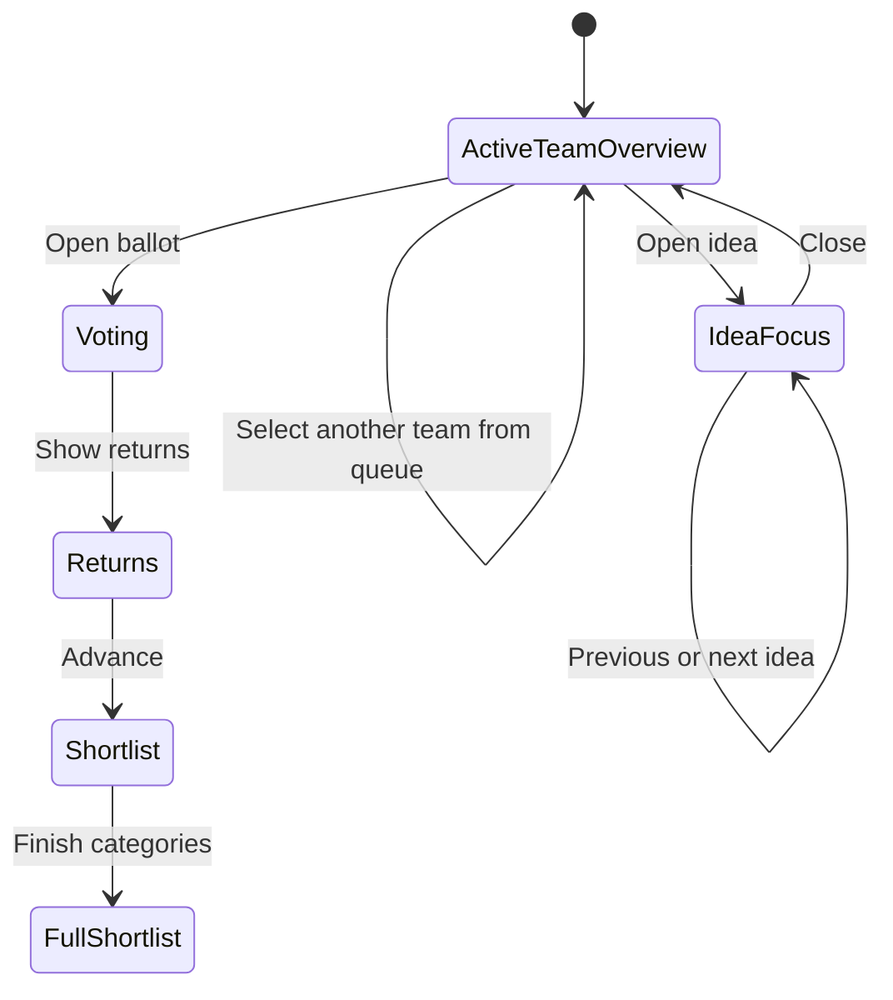
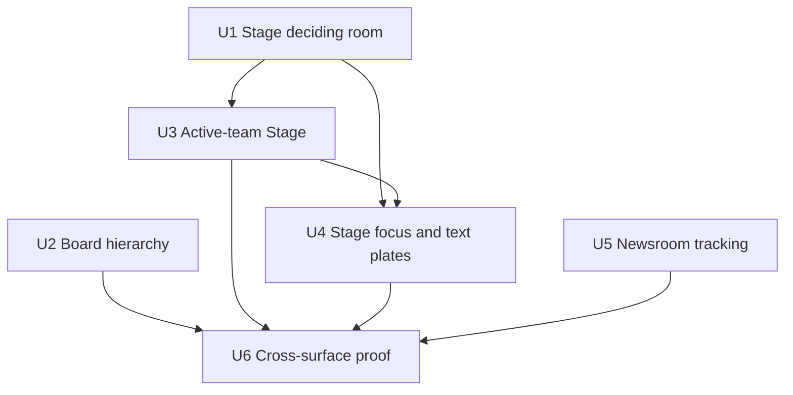

# refactor: Sharpen Board, Stage, and Newsroom hierarchy

## Summary

Refine the three core workshop surfaces without expanding the product model: keep the Board fast and expressive, give the active team the Stage, and make the Newsroom report the room rather than rank it. The Stage will pass through a mock-first checkpoint before its production layout changes; the Board and Newsroom can move directly into implementation.

---

## Problem Frame

The surfaces already share a strong Ogilvy visual system, but their information hierarchy does not yet match their jobs. The Board's control pockets interrupt the visible idea sequence, the Stage gives inactive teams too much of the shared screen while shrinking the team that is speaking, and the Newsroom implies competition through ranking while spending a marquee metric on an estimated word count.

The revisions need to work within the current workshop model: one description per idea, one room-facing Stage, variable idea density, no new facilitator console, and no additional intelligence or generation APIs.

---

## Requirements

- R1. Preserve the Board's Pinterest-style masonry and its ability to accommodate text cards and taller 16:9 visualized cards.
- R2. Keep one description field per idea. The closed card may line-clamp it; the open card must show the same description in full and remain editable.
- R3. REMOVE the idea count from the Board hero entirely (user ruling 2026-08-02: "do we even need the total ideas counter?" — no). Per-category counts stay in the tabs, where they are actionable; the cross-team view lives in the Newsroom. The platform name then owns the whole band, which also discharges R5's collision problem.
- R4. Move Add and Scout out of the masonry SEQUENCE — but NOT into a smaller rail (user ruling 2026-08-02: a rail shrinks them and risks colliding with the tabs; "keeping the big obvious boxes"). Keep them at their current size and prominence in their own band directly beneath the category tabs and above the masonry, so №01 starts column one while the controls stay unmissable. This SUPERSEDES Round 6's recessed-pocket treatment; record that in the ledger at U6.
- R5. Make the Board's creative-platform title and count responsive enough to remain legible without collision at narrow laptop widths.
- R6. Keep the Stage as one shared room-facing screen. Do not create separate facilitator and spectator products, routes, or permissions.
- R7. In the Stage's presenting state, give the active team the main viewport and reduce inactive teams to a compact, selectable queue.
- R8. Support realistic Stage density: five ideas should feel composed, six should remain readable at 1280×720, and ten or more should remain navigable without moving the persistent control strip.
- R9. Keep idea focus temporary and local to the Stage: open an idea over the active-team overview, provide previous/next movement and current shortlist actions, then return to the same overview on close.
- R10. Give ideas without generated imagery a deliberate 16:9 typographic plate on room-facing Stage surfaces; never fabricate a decorative image or require an image-generation call.
- R11. Preserve existing voting, returns, full-shortlist, offline showcase, realtime, and Control Strip behavior.
- R12. Replace the Newsroom's estimated “Words written” metric with the exact number of coaching sessions.
- R13. Present per-team Newsroom rows in stable configured order, without rank numerals, winner treatment, or leader sorting.
- R14. Keep Pace, the activity wire, category breakdown, and ticker behavior unchanged.
- R15. Respect the existing Ogilvy type, color, motion, projector-legibility, and 16:9 print laws across every changed state.

---

## Scope Boundaries

- No second Stage application, hidden facilitator console, user role, permission layer, or mirrored spectator route.
- No new “what it is” field, schema change, database migration, or duplicate description workflow.
- No new card-size taxonomy on the Board. Visualized cards keep their existing natural 16:9 growth.
- No Director's Cut in this pass; it belongs to a later post-voting shortlist review.
- No Signal Desk, summarization feed, external intelligence API, or additional model call.
- No Convergence Field during generation; reconsider it only for post-generation synthesis.
- No redesign of Pace, the wire, or the ticker.
- No changes to entry, coaching, vote, or report surfaces beyond guarding shared-component regressions.

### Deferred to Follow-Up Work

- The shared activity clock (mocked at `/card-lab#clock-round`, landed on the Board's hero band beside the idea count): PARKED by user ruling 2026-08-02 — "hold on the clock for now, prioritize this plan." Note that R3 removes the count it was designed to pair with, so the clock's band composition must be re-judged, not resumed, when it comes back.

- Director's Cut: explore as a separate shortlist-review state after voting behavior and room facilitation have been observed.
- Room intelligence: revisit a deterministic “Room Read” or Convergence Field only once there is a clear surface and moment for it.

---

## Context & Research

### Relevant Code and Patterns

- `docs/ogilvy-showcase-direction.md` is the design contract. Round 4 governs motion and type; Round 6 governs Board controls and print dominance; Rounds 7–9 govern Stage hierarchy, controls, and 16:9 prints.
- `app/app/[team]/page.tsx` already computes the team's complete idea collection, category-filtered ideas, and category counts. The hero currently reads the filtered count, and Add/Scout currently occupy the first masonry slot.
- `app/components/IdeaCard.tsx` already reuses the idea description and lets a developed print make a card taller. That behavior should be preserved.
- `app/app/center-court/components/PillarView.tsx` already receives the active team as `spotlightTeam`, can switch teams, separates presenting from returns, and owns the scrollable Stage work area.
- `app/app/center-court/page.tsx` already owns temporary `openedIdea` state, previous/next navigation, and the presentation-mode overlay. A new global mode is unnecessary.
- `app/components/ExpandedCard.tsx` already has a guarded `presentationMode` branch and the shared idea actions. Stage-specific improvements should remain behind that branch so the Board editor does not drift.
- `app/app/center-court/components/FullLineupView.tsx` already mounts full 16:9 prints but gives text-only shortlist cards a much weaker treatment.
- `app/app/big-board/page.tsx` already requests an exact `training_notes` count, but converts it into an estimated word count. It also sorts team rows and assigns rank/leader treatment.
- `app/app/atmosphere-lab/page.tsx` and `app/app/card-lab/page.tsx` establish labs as non-production deciding rooms for visual choices.
- The repository has browser-based review scripts but no component test runner. This pass should add one bounded Playwright review script rather than introduce a second test stack.

### Institutional Learnings

- The Board's controls are pockets, not frames; they should remain quiet and must not compete with ideas at a squint.
- Stage motion reports an event, then stops. No looping movement should be added while the room is reading.
- Team hue belongs in spines, tints, and swatches on dark surfaces. Room-facing display type remains white for projection.
- The print is the full-frame truth. Generated images remain 16:9 and contain-fit on Board and Stage mounts.
- The Kruger bar marks the current object, not navigation or a team that happens to have submitted more ideas.

### External References

- None. The repository contains direct, recent patterns for all changes in this plan; outside research would not resolve a current product or implementation uncertainty.

---

## Key Technical Decisions

| Decision | Direction | Why |
|---|---|---|
| Board controls | Same-size boxes lifted into their own band above the masonry | Ideas start the wall without shrinking the two actions a team uses most. A rail would trade prominence for tidiness and crowd the tabs. |
| Board counts | No hero count; category totals in tabs only | A number that drives no decision is decoration. Removing it gives the platform name the full band and resolves the narrow-width collision without a type step. |
| Stage architecture | Restyle the existing presenting state; add no workshop-state value | Active team, current category, voting, and results already exist. This is a composition change, not a workflow change. |
| Stage queue | Mock a stacked queue and a side rail; ship one after projector review | Both honor the one-screen constraint. The lab resolves placement without committing production logic to an untested composition. |
| Stage focus | Extend the existing presentation-mode overlay | Preserves navigation, editing, shortlist, set-aside, and reassignment behavior without building a parallel card system. |
| Text-only Stage cards | One deterministic typographic plate component | Gives non-visualized ideas equal compositional intent without pretending an image exists or calling a model. |
| Newsroom rows | Stable `GROUP_LIST` order, no ranking | The surface tracks the room; it does not score teams against one another. |
| Newsroom coaching metric | Use the exact existing note count directly | Replaces an estimate with a more useful signal while reducing the current fetch, not adding an API call. |

---

## Open Questions

### Resolved During Planning

- Does the Board need a second “what it is” field? No. The description remains the single source of truth and changes only in presentation depth.
- Should visualized Board cards receive another explicit size tier? No. Their existing full-width 16:9 image already creates the right distinction.
- Does the Stage need facilitator and spectator modes? No. It needs clearer temporary states on the same shared screen.
- Should the Stage feature one hero idea? No. The active-team overview must support five to ten or more ideas; a single idea becomes prominent only when someone opens it.
- Should Director's Cut be part of the presenting pass? No. Defer it to post-voting shortlist review.
- Does the Newsroom rank teams? No. It tracks each team's contribution in stable order.

### Deferred to Implementation

- Exact queue placement: choose stacked queue or side rail after comparing both at 1280×720 and 1920×1080 in the Stage lab.
- Exact Stage grid density above ten ideas: tune during visual implementation while preserving the requirement that six are readable at 1280×720 and overflow remains obvious.
- Exact narrow-width type step for unusually long platform names: tune against the longest configured title rather than hard-coding around the current three examples.

---

## High-Level Technical Design

> *This illustrates the intended approach and is directional guidance for review, not implementation specification. The implementing agent should treat it as context, not code to reproduce.*

The Stage keeps its existing workshop states. Only the composition of `pillar / presenting` and the local idea overlay changes.

The screen jobs remain distinct:

| Surface | Primary job | Revision | Preserve |
|---|---|---|---|
| Board | Capture and develop ideas | Clear the idea sequence and strengthen responsive hierarchy | Masonry, one description, mixed card heights |
| Stage | Help one room present and decide | Active-team viewport, compact team queue, temporary idea focus | One shared screen, voting flow, control strip |
| Newsroom | Show the room's activity | Exact coaching count and non-ranked team tracking | Pace, category breakdown, wire, ticker |

---

## Implementation Units

### U1. Build the Stage deciding room

**Goal:** Make the Stage recommendation visible and reviewable before production components change.

**Requirements:** R6, R7, R8, R9, R10, R15

**Dependencies:** None

**Files:**
- Create: `app/app/stage-lab/page.tsx`
- Create: `scripts/visual-qa-board-stage-newsroom.mjs`
- Read/reuse: `app/lib/showcase-data.ts`
- Read/reuse: `app/lib/config.ts`
- Read/reuse: `app/lib/motion.ts`

**Approach:**
- Build a self-contained, clearly labeled “DO NOT SHIP” Stage lab with no Supabase reads or writes.
- Show two queue placements using the same content and hierarchy: a stacked inactive-team queue and a narrow side rail. Default the lab to the stacked queue because it preserves more horizontal width for mixed 16:9 cards.
- Provide fixture switches for five ideas, six mixed text/print ideas, and ten-plus ideas.
- Include both active-team overview and temporary idea-focus states. Keep the existing category tabs and Control Strip proportions visible so the mock represents the whole shared screen, not a detached card comp.
- Judge the candidates by room readability, visible idea capacity, ease of identifying the next team, and whether the operator's controls remain obvious without becoming a separate interface.
- Add a bounded review script that uses one headless browser, captures named states, and closes the browser in a `finally` block even if an assertion fails.

**Patterns to follow:**
- Lab framing and explicit non-production labeling in `app/app/card-lab/page.tsx`.
- Static visual comparison approach in `app/app/atmosphere-lab/page.tsx`.
- Motion tokens in `app/lib/motion.ts`.

**Test scenarios:**
- Happy path: switch between the two queue placements with the six-idea fixture; active team, queue, category, and controls remain visible in both.
- Density edge: select the ten-plus fixture; the active idea area scrolls, the inactive queue remains compact, and the Control Strip stays fixed.
- Content edge: select the mixed fixture; full 16:9 prints remain uncropped and text-only ideas carry equal visual intent.
- Interaction: open an idea, move previous/next, close it, and return to the same team and scroll position.
- Isolation: load the lab with network requests inspected; it makes no Supabase mutation and does not alter workshop state.
- Browser hygiene: force a failed visual assertion; the script still exits without leaving a Chromium process behind.

**Verification:**
- Review captures exist for both queue candidates at 1280×720 and 1920×1080, plus the ten-plus density and idea-focus states.
- One candidate is recorded as the production direction before U3 begins.

### U2. Repair the Board's hierarchy and responsive hero

**Goal:** Let ideas begin the board while keeping creation tools, team momentum, and category navigation immediately legible.

**Requirements:** R1, R2, R3, R4, R5, R15

**Dependencies:** None

**Files:**
- Modify: `app/app/[team]/page.tsx`
- Modify test: `scripts/visual-qa-board-stage-newsroom.mjs`
- Verify unchanged behavior: `app/components/IdeaCard.tsx`
- Verify unchanged behavior: `app/components/ExpandedCard.tsx`

**Approach:**
- Remove the hero idea count and its label entirely; leave tab counts sourced from category totals. Let the creative-platform name take the band's width.
- Lift Add and Scout out of the masonry into their own band between the category tabs and the grid, KEEPING their current size and treatment. They must not shrink, and must not sit close enough to the tabs to read as part of the navigation.
- Preserve the current filtered sorting and frame numbering so №01 is the first rendered idea in the selected category.
- Use fluid sizing and controlled wrapping/truncation for the creative-platform title and count. Protect the hierarchy of platform name first, team label second, count third.
- Do not introduce a summary field, recompute description content, or alter the printed card's 16:9 sizing.

**Patterns to follow:**
- Board control-slot restraint from Round 6 in `docs/ogilvy-showcase-direction.md`.
- Existing category counts and filtered ordering in `app/app/[team]/page.tsx`.
- Closed/full description behavior in `app/components/IdeaCard.tsx` and `app/components/ExpandedCard.tsx`.

**Test scenarios:**
- Happy path: a team with ideas in all three categories shows NO hero count while each tab shows its own count.
- Sequence: open each category; the first masonry frame is the category's №01 idea and Add/Scout never consume a numbered position.
- Description parity: open a line-clamped card; the expanded card contains the same description text in full and edits continue to save to the same field.
- Visual-card regression: a developed 16:9 image remains fully visible and the card grows taller than a text-only card without forcing row height.
- Responsive edge: the longest configured platform name at approximately 918px wide does not collide with the QR action or navigation (there is no longer a count to collide with).
- Empty state: a category with no ideas still exposes Add and Scout and shows the existing empty-state guidance.

**Verification:**
- Review the Board at approximately 918×929, 1280×720, and 1600×1000 with text-only, mixed, and empty categories.
- Switching tabs changes cards and tab counts; the hero carries the platform name and no count at any width.

### U3. Give the active team the Stage viewport

**Goal:** Turn the presenting view into a clear active-team canvas that still makes the rest of the room's queue visible and selectable.

**Requirements:** R6, R7, R8, R11, R15

**Dependencies:** U1 and an approved queue placement

**Files:**
- Modify: `app/app/center-court/components/PillarView.tsx`
- Modify if integration requires it: `app/app/center-court/page.tsx`
- Modify test: `scripts/visual-qa-board-stage-newsroom.mjs`

**Approach:**
- Apply the selected lab composition only to the non-voting, non-results presenting branch.
- Render the active team's identity, creative platform, idea count, and fallback-selection note as the main section header.
- Render inactive teams as compact queue entries with name, platform, idea count, and a clear “present next” affordance. Clicking one should continue to use the existing spotlight callback.
- Allocate the scrollable work area to active-team ideas. Keep the page frame, category navigation, and Control Strip fixed.
- Preserve the existing selected-versus-all fallback, idea actions, mixed text/print grid rules, quick-add behavior, voting overlay, returns ranking, bench, and full-shortlist route.
- Avoid new workshop-state fields. The current active-team value remains the source of truth.

**Patterns to follow:**
- Existing `spotlightTeam` and `onSpotlightTeam` flow in `PillarView.tsx`.
- Existing fixed-shell/scrolling-work-area boundary in `app/app/center-court/page.tsx`.
- One-primary-per-state rule in `ControlStrip.tsx`.

**Test scenarios:**
- Happy path: opening a category gives the configured active team the main viewport and shows the other teams once each in the queue.
- Team handoff: select another queue entry; its ideas, platform, color spine, position information, and Control Strip team label update together.
- Density edge: active teams with zero, one, five, six, and ten-plus ideas remain understandable; ten-plus scrolls inside the work area.
- Fallback edge: a team with no `presenting` selections shows its active ideas and the existing fallback note; a team with no ideas shows a deliberate empty state.
- Workflow regression: open voting, show returns, advance to the category shortlist, and open the full shortlist; those views retain their existing behavior and hierarchy.
- Offline integration: change active team and workshop phase in showcase mode; the shared screen updates without a backend.

**Verification:**
- At 1280×720, six active-team ideas are readable and the queue plus Control Strip remain visible.
- At ten-plus ideas, no inactive-team section consumes active-team card space and the Control Strip never scrolls away.
- Voting and returns screenshots match the current approved composition except where the active presenting layout intentionally changes.

### U4. Strengthen Stage idea focus and text-only presentation

**Goal:** Make both visualized and text-only ideas feel deliberate when the room opens or shortlists them.

**Requirements:** R9, R10, R11, R15

**Dependencies:** U1, U3

**Files:**
- Create: `app/components/StageIdeaPlate.tsx`
- Modify: `app/app/center-court/components/PillarView.tsx`
- Modify: `app/app/center-court/components/FullLineupView.tsx`
- Modify: `app/components/ExpandedCard.tsx`
- Modify test: `scripts/visual-qa-board-stage-newsroom.mjs`

**Approach:**
- Build one shared Stage-specific typographic plate for ideas without a developed print. Compose existing idea data—frame number, title, description excerpt, team, platform, and category—inside a 16:9 room-facing frame. Keep it in `app/components/` so the Stage views and the shared presentation-mode card can consume it without importing from a route directory.
- Use the plate in the active-team overview and full shortlist. Use existing `PrintReveal` behavior for developed imagery; do not wrap prints in the text plate or crop them.
- Refine the existing `presentationMode` branch of `ExpandedCard` so the idea title, full description, and print carry the focus state before secondary controls. Keep current editing/autosave semantics and shared Stage actions available but visually subordinate.
- Keep focus controlled by `openedIdea` in the Stage page. Previous/next navigation should stay scoped to the current ordered Stage collection and closing should reveal the same overview beneath it.
- Use only event-based entry/exit motion from the shared motion tokens. Nothing should animate continuously while the room reads.

**Patterns to follow:**
- Presentation-mode guard in `app/components/ExpandedCard.tsx`.
- Full-frame print law and `PrintReveal` use in `FullLineupView.tsx`.
- Sans-bold idea-title and projector-contrast rules in Round 7 of `docs/ogilvy-showcase-direction.md`.

**Test scenarios:**
- Happy path: open a developed idea from the active-team overview; the full 16:9 print, title, full description, position, and actions are legible at 1280×720.
- Text-only path: open a non-visualized idea; the overview, focus state, and full shortlist all use the intentional typographic treatment with no broken-image or blank-media region.
- Navigation: previous/next moves through the current ordered Stage ideas and updates the team/position metadata correctly at collection boundaries.
- Action regression: shortlist, set aside, reassign, and close continue to update the existing data path and return to the overview.
- Shared-component regression: open the same idea from the Board; non-presentation sizing, editing, print chips, and action hierarchy remain unchanged.
- Motion/accessibility: reduced-motion preference removes nonessential transitions; focus lands inside the overlay and returns to the triggering card on close.

**Verification:**
- The Stage focus state reads as the room's current object from projector distance, while controls remain usable on the shared screen.
- Text-only ideas no longer look like unfinished image cards in either the presenting wall or full shortlist.

### U5. Turn the Newsroom from standings into tracking

**Goal:** Replace the least useful estimate and remove unintended competition without disturbing the live reporting surface.

**Requirements:** R12, R13, R14, R15

**Dependencies:** None

**Files:**
- Modify: `app/app/big-board/page.tsx`
- Modify test: `scripts/visual-qa-board-stage-newsroom.mjs`

**Approach:**
- Replace the word-count state and calculation with the exact `training_notes` count already returned by the existing head-count query.
- Remove the ideas-text fetch used only for the estimate. Keep the existing refresh cadence unless implementation reveals that the current showcase proxy handles the count differently.
- Label the marquee metrics so “Ideas coached” and “Coaching sessions” are unambiguous.
- Build team rows in configured order. Remove ordinal numerals, leader detection, Kruger treatment, layout-reorder animation, and competitive “standings” framing.
- Preserve each team's total, coached, scouted, and Pace values; keep team color as an identity spine rather than a rank signal.
- Do not change category breakdown calculations, activity feed behavior, realtime idea updates, wire copy, or ticker.

**Patterns to follow:**
- Stable team identity order from `GROUP_LIST` in `app/lib/config.ts`.
- Exact count query already present in `app/app/big-board/page.tsx`.
- Red/Kruger discipline in `docs/ogilvy-showcase-direction.md`.

**Test scenarios:**
- Happy path: three teams with unequal idea totals stay in configured order and show accurate per-team values.
- Metric correctness: five training-note rows render as five coaching sessions rather than an estimated word total.
- Empty state: zero coaching sessions renders as `0`; missing team records still leave a stable placeholder row without reordering other teams.
- Live update regression: a new idea updates total ideas, team ideas, Pace inputs, and the wire without changing team row order.
- Preserve behavior: category breakdown segments, Pace labels, activity events, and ticker content remain unchanged.
- Visual hierarchy: no row receives a rank numeral or leader-red treatment solely because its idea total is highest.

**Verification:**
- The marquee shows Ideas on the board, Ideas coached, Scouted, and Coaching sessions with exact values.
- A screenshot with deliberately unequal team totals still reads as a tracking desk, not a leaderboard.

### U6. Prove the three surfaces together and record the decision

**Goal:** Validate the pass at real workshop sizes, protect unchanged flows, and make the accepted Stage direction durable.

**Requirements:** R1–R15

**Dependencies:** U2, U3, U4, U5

**Files:**
- Modify: `scripts/visual-qa-board-stage-newsroom.mjs`
- Modify: `docs/ogilvy-showcase-direction.md`
- Create review captures: `output/playwright/surface-hierarchy/`

**Approach:**
- Capture a concise proof set: Board narrow/mixed, Stage six/ten-plus/focus/text-only/voting/returns/full shortlist, and Newsroom unequal-team tracking.
- Run the three complete room flows, not isolated screenshots: Board card to open idea, Stage active team through focus and voting, and Newsroom initial load through a live idea update.
- Compare typography, one-Kruger discipline, print framing, and control hierarchy against the existing design contract.
- Add the accepted Board/Stage/Newsroom rulings as the next settled round in the design-direction document. Record deferred ideas separately so they are not mistaken for missing implementation.
- Keep automated browser use bounded to one headless process and close all pages, contexts, and the browser in cleanup regardless of pass or failure.

**Patterns to follow:**
- Settled-round format in `docs/ogilvy-showcase-direction.md`.
- Existing named screenshot sets under `output/playwright/`.

**Test scenarios:**
- Integration: move from a team Board to the Stage and Newsroom using the shared showcase dataset; idea names, counts, status, print, and team identity agree across surfaces.
- Projector matrix: review Stage and Newsroom at 1280×720 and 1920×1080; all room-facing primary text meets the existing contrast and size rules.
- Laptop matrix: review Board at approximately 918×929, 1280×720, and 1600×1000; controls remain reachable and hierarchy does not collapse.
- Stress: use a team/category with ten-plus Stage ideas and long titles; overflow is obvious and no fixed chrome is displaced.
- Cleanup: after successful and intentionally failed runs, no browser process launched by the script remains active.

**Verification:**
- The proof set covers every changed state and the protected voting/results states.
- The design-direction document records what shipped, what stayed unchanged, and what remains deferred.
- The production build and lint complete with no new errors; any pre-existing warnings are listed separately rather than hidden.

---

## System-Wide Impact

- **Interaction graph:** Board and Newsroom changes remain local to their pages. The Stage reuses the existing active-team callback, local `openedIdea` overlay, data hooks, and Control Strip; it does not create another orchestration path.
- **Error propagation:** No new backend call is introduced. Existing Supabase/showcase error behavior remains in place; the Newsroom removes one ideas-text request from its metric calculation.
- **State lifecycle risks:** The highest risk is losing the active team's scroll/focus position when opening or switching ideas. Keep the overview mounted beneath the local overlay and restore focus on close.
- **API surface parity:** No schema, route contract, public type, environment variable, or permission model changes.
- **Integration coverage:** Browser review must cover both showcase mode and the existing live-data shape because all three surfaces consume the same ideas and team records.
- **Unchanged invariants:** One idea description, one Stage screen, one workshop-state flow, full-frame 16:9 prints, existing vote/result choreography, Pace, wire, and ticker all remain intact.

---

## Risks & Dependencies

| Risk | Likelihood | Impact | Mitigation |
|---|---:|---:|---|
| The active-team layout still feels crowded with ten-plus ideas | Medium | High | Resolve queue placement in the lab, keep the card field internally scrollable, and test the density fixture before production. |
| A Stage-specific change leaks into Board editing through `ExpandedCard` | Medium | High | Keep every hierarchy adjustment behind `presentationMode` and include a Board-open-card regression scenario. |
| The typographic fallback competes with real prints or reads as a fake poster | Medium | Medium | Use existing data and Stage tokens only; keep generated prints visually dominant and avoid decorative illustration. |
| Responsive Board title changes weaken the creative platform's prominence | Low | High | Test the longest configured title at the known narrow viewport and treat title scale as the protected variable. |
| Removing rank leaves dead space in Newsroom rows | Medium | Medium | Rebalance the team identity column and metric columns in the same unit; do not fill the space with another signal. |
| Browser-based proof leaves local processes running | Low | High | One headless browser, cleanup in `finally`, and an explicit failure-path cleanup check. |

---

## Phased Delivery

### Phase 1 — Decide the Stage composition

- Land U1 only. Review both queue placements and density states; record the selected production composition.

### Phase 2 — Apply the surface revisions

- U2 and U5 can proceed independently.
- U3 follows the approved Stage mock.
- U4 follows once the active-team geometry is stable.

### Phase 3 — Cross-surface proof

- Run U6 after all three surfaces are integrated, then record the settled design rulings.

---

## Documentation / Operational Notes

- Keep `/stage-lab` as a deciding-room artifact unless the team explicitly asks to remove it; it documents the rejected queue option and density tests.
- Do not add production analytics, feature flags, or migrations for this pass.
- Visual review should use bounded headless automation or the in-app browser. Do not open persistent production Chrome profiles.
- New screenshot output should be limited to the named proof states; discard exploratory duplicates rather than leaving an uncurated folder.

---

## Sources & References

- Design contract: `docs/ogilvy-showcase-direction.md`
- Board shell: `app/app/[team]/page.tsx`
- Board cards: `app/components/IdeaCard.tsx`
- Shared open card: `app/components/ExpandedCard.tsx`
- Stage shell: `app/app/center-court/page.tsx`
- Stage presenting view: `app/app/center-court/components/PillarView.tsx`
- Stage shortlist: `app/app/center-court/components/FullLineupView.tsx`
- Stage controls: `app/app/center-court/components/ControlStrip.tsx`
- Newsroom: `app/app/big-board/page.tsx`
- Workshop configuration: `app/lib/config.ts`
- Showcase fixtures: `app/lib/showcase-data.ts`
