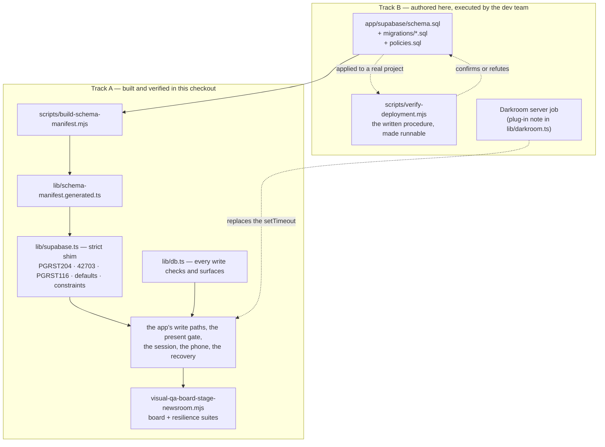
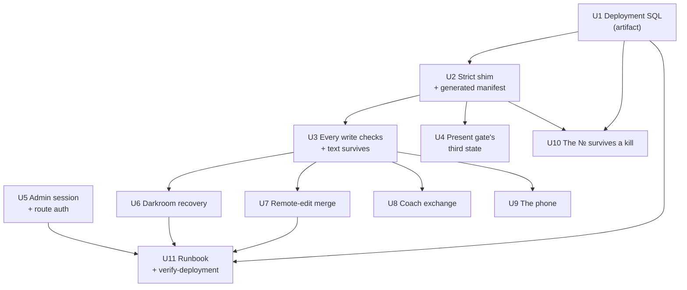

# harden: Make the showcase survivable in a live room

## Summary

Close sections A and B of `docs/open-items.md` — the seven defects that block a real deployment and the six that would embarrass a real workshop — without pretending this repository can do something it cannot. The work splits in two and the split is the plan's central ruling: **what we can build AND verify here**, and **what we can only author as reviewable, runnable artifacts for whoever stands up the real deployment**. The join between the two halves is a strict shim: the migration SQL becomes the source of a generated column manifest that the in-memory Supabase shim enforces, so a schema the showcase has no database to test against still fails loudly in the showcase the moment the app writes a column the migration does not declare.

---

## Problem Frame

The Ogilvy showcase is a frontend-only build. `app/lib/supabase.ts` resolves to a real `@supabase/supabase-js` client when `NEXT_PUBLIC_SUPABASE_URL` and `NEXT_PUBLIC_SUPABASE_ANON_KEY` are both present, and to a hand-written in-memory engine when either is missing. This checkout has neither, so every run — dev, review harness, every capture in `output/playwright/` — exercises the shim, never Postgres.

That is fine for judging composition and it is exactly how Rounds 15–19 were settled. It is not fine for judging correctness, because the shim is permissive where PostgREST is strict, and every place the two disagree is a defect the repository cannot currently see. `docs/backend-audit.md` §1.3 enumerates eleven such divergences. The most expensive is the first: the shim's `update` is `Object.assign(row, payload)`, so it accepts writes to columns that exist in no migration. Six columns are in that state today — `presenting`, `print_status`, `print_options`, `print_url`, `print_source`, `print_note` — and against a real Postgres every Present toggle and every Darkroom commission returns HTTP 400 `PGRST204` and changes nothing.

Two consequences make that a room-level failure rather than a feature gap. `commissionPrint` sends `name` and `description` in the same statement as the print columns, so a rejected commission also discards the participant's text edits. And with `presenting` never readable, `teamStageIdeas` takes its `showingAllFallback` branch for every team, which since Round 16 also governs the phone ballot — so **the room votes on a set it was never shown**, and no surface says so. Not one of the app's ~60 client-side write sites checks `error`, so all of this happens in silence.

Underneath that sit the rest of section A: no RLS and no policies (either the anon key in ~69 phones can delete the workshop, or RLS goes on with no policies and the app renders a blank, error-free room); no authentication on any mutating or AI route, so `PUT /api/settings` can rewrite `workshop_state` and the coach prompts from a public URL; `cast_vote`'s `FOR UPDATE` locking nothing on a voter's first ballot; a middleware that fails OPEN when `ADMIN_PASSWORD` is unset, holding the plaintext password as its own session cookie; realtime DELETE that can never match the Board's `team_id` filter under `REPLICA IDENTITY DEFAULT`; and a Darkroom develop that is a `setTimeout` in one browser tab, so a refresh strands the row in `developing` with no code path anywhere that clears it.

Section B is smaller but touches the participant directly: the iOS keyboard covering ADD IDEA, open cards clobbering each other's edits, an abandoned coach exchange that is lost while the idea still counts as coached, the Board scrolling sideways at 390px, a vote receipt that dies on reload, and a № that a deletion reclaims.

None of the schema work can be applied or tested in this checkout. The plan's job is to say honestly which half is which, and to make the untestable half as reviewable and as runnable as an artifact can be.

---

## Requirements

- R1. Ship the six missing `ideas` columns as a real, runnable migration file in the repository, with the CHECK constraint the audit specifies and no index the app does not need.
- R2. Ship RLS policies as a real, runnable file, covering every table, with an explicit posture for `anon` per table and per verb — never "RLS on, decide later".
- R3. Ship the `cast_vote` locking fix, the `max_votes_per_pillar` parse hardening, and `alter table ideas replica identity full` as runnable SQL alongside the migration.
- R4. Make the in-memory shim reject what PostgREST rejects — at minimum unknown columns on write, unknown columns in an explicit select list, and `.single()` on zero rows — so a schema drift of the class that produced defect #1 fails in the showcase on the day it is introduced.
- R5. Derive the shim's column knowledge from the checked-in SQL rather than a hand-maintained list, and provide a check that fails when the two diverge.
- R6. Every write path in the app checks its result and surfaces the failure on the surface that issued it. No mutating call may discard `error`.
- R7. A participant's text edits must never be lost by an unrelated failure. Text persistence and print-state persistence must not share a statement.
- R8. The present gate must be able to tell "this team chose nothing" apart from "this deployment cannot read the field", and must refuse to widen the ballot in the second case.
- R9. `/admin` must fail CLOSED when `ADMIN_PASSWORD` is unset, and the admin session cookie must not be the password.
- R10. Every mutating and every model-calling API route must require the admin session, except the participant-facing vote and idea-capture paths, which stay open by design.
- R11. A refresh, a closed tab or a lost network during a Darkroom develop must leave the idea recoverable from the app, with no database intervention.
- R12. Two surfaces open on the same idea must not silently clobber each other's text. A remote edit is either merged or reported.
- R13. An abandoned coach exchange must either be persisted or must not mark the idea coached. The Newsroom's coaching count and the `COACHED` stamp must agree.
- R14. The phone's primary action must remain reachable above the iOS keyboard, the vote receipt must survive a reload, and no room surface may scroll horizontally at 390×844.
- R15. Rule on whether `idea_no` becomes a stored column; whichever way it goes, ship the answer as an artifact rather than a paragraph.
- R16. Produce a written, runnable verification procedure the deployment team executes against a real project — every Track B claim must have a check that proves or disproves it.
- R17. Extend `scripts/visual-qa-board-stage-newsroom.mjs`. Do not create a second harness, and do not fork its helpers.
- R18. Every changed state stays inside the design contract in `docs/ogilvy-showcase-direction.md` — the registers, the serif law, one Kruger, the red discipline, the projector floor, the 16:9 print law.

---

## Scope Boundaries

- Sections A and B of `docs/open-items.md` only. Section C is a set of user decisions, not work, and nothing here pre-empts them. Section D stays parked.
- No new product surface, no new workshop state, no new route in the participant flow, no vocabulary change. This is a hardening pass over surfaces Rounds 15–19 settled.
- No redesign of anything section C is still holding open — the 55% Stage spine dim, the mobile copy sweep, the seam bridge, the PROOF SHEET edge slug, admin's register, the deck's typefaces.
- No Supabase project is provisioned, configured, or connected by this plan. Nothing here applies a migration.
- No second test stack. No Vitest, no Jest, no component runner. The review harness is the harness.
- No change to `lib/present-gate.ts`'s ruling. The gate stays client-side, per team, with the fallback intact — Round 16 item 1 settled that, and moving it into SQL cannot express the per-team fallback in one filter.
- No change to the `ideaNumbers()` derivation as the default. See U10 for what does change.
- No rewrite of the realtime layer. `docs/backend-audit.md` §3.2 is right that ignoring the payload and refetching is the most robust thing in the build; nothing here reads `payload.new`.

### Deferred to Follow-Up Work

- **Audit #8 — `workshop_settings` subscribers listening for `UPDATE` only, and `voting_enabled` never re-read.** A one-line change on each, but it lives in `app/vote/page.tsx` and `useCenterCourtData.ts`, and it is not in section A or B. Recommend it as the first follow-up: a phone already open when the facilitator calls the vote currently never sees the ballot without a reload.
- **Audit #9 — showcase-mode detection is build-time and silent.** The persistent "SHOWCASE — NO BACKEND" chip and the build-time failure on a half-set env pair are deferred. What this plan does take is the runnable half: `scripts/verify-deployment.mjs` (U11) reports the resolved mode as its first check, so the failure mode is caught by procedure rather than by UI.
- **Audit #10–#19** — the autosave precondition is partly addressed by U7 but the full three-surface field-level rewrite is not; `merge_ideas` idempotency, the `/api/phase` and `/api/merge` env landmines, `scripts/clear-data.ts`'s writes to columns that exist in no schema, the `select("*")` payload trim across six surfaces, the `/api/ideas` PATCH allow-list, `/api/scout`'s leaked provider error text, `/api/report`'s unescaped XML interpolation, and the dead `pillar_visions` table. All ranked in the audit; none in section A or B.
- **A `print_runs` history table.** `lib/darkroom.ts` already names it as the real implementation's shape. Not needed to survive a room.
- **Rate limiting on the AI routes.** U5 closes them behind the admin session, which removes the public-URL exposure; a rate limit is a separate posture decision tied to the hosting platform.

---

## Context & Research

### Relevant Code and Patterns

- `docs/backend-audit.md` is the substance of this plan. §1.1 carries the migration DDL and the column-by-column reasoning; §1.3 is the shim-divergence table that U2 turns into code; §5.1 is the `cast_vote` analysis; §6.3 is the RLS decision; §6.4 is the auth decision; §7 is the ranked list this plan works down.
- `app/lib/supabase.ts` is ~390 lines and self-contained: a `ShowcaseQuery` builder whose `exec()` switches on `select | insert | update | delete | upsert`, a `showcaseRpc` implementing exactly `cast_vote` and `merge_ideas`, and a `BroadcastChannel('basecamp-showcase')` bus with a hello/snapshot join handshake. Every strictness change in U2 lands inside `exec()` and `showcaseRpc`; nothing else in the file moves.
- `app/supabase/schema.sql` is the checked-in truth and contains no `enable row level security`, no policy, and none of the six columns. It also carries the `cast_vote` and `merge_ideas` function bodies, the realtime publication and the placeholder seed.
- `app/components/ExpandedCard.tsx` holds three of the write paths this plan changes: `handleTogglePresent` (~L416, the only writer of `presenting` in the app), the 700ms debounced `persist()` autosave (~L475), and `handleDelete` (~L513, three sequential unchecked statements). The autosave already has the right shape — a `savedRef`, a flush on unmount, a flush on Done — it simply never learns that a write failed.
- `app/lib/darkroom.ts` `commissionPrint` (L242–L272) is where R7 lands: one statement carrying `name`, `description`, `print_status`, `print_source`, `print_note`, then a `setTimeout` that fires a second statement 20–30s later from the same tab. The file's own "REAL IMPLEMENTATION PLUG-IN" comment block is accurate and should be followed, not rewritten.
- `app/lib/present-gate.ts` is 49 lines and is read by three surfaces. `teamStageIdeas` computes `selected = active.filter(i => i.presenting)` — with the column absent, `selected` is always empty and `showingAllFallback` is always true. R8's fix is a third state in this one function, not a change at three call sites.
- `app/middleware.ts` is 35 lines: `if (!adminPassword) return NextResponse.next()` is the fail-open, `adminAuth?.value === adminPassword` is the plaintext comparison, and `matcher: ["/admin/:path*"]` is why the API surface is uncovered. `app/app/admin-login/page.tsx` sets the cookie with `document.cookie`, so the secret is readable by any script on the origin.
- `app/app/vote/page.tsx` L70 and L171–175: `ballotIn` is React state, set from `effectiveMyVotes`, and it is the entire receipt. A reload after the facilitator closes the vote drops it and the phone falls back to the neutral `Sheet`.
- `app/app/[team]/quick-add/page.tsx` L398–L478: the textarea carries `autoFocus`, the ADD IDEA button sits after it and after the optional-name input in normal flow, and both inputs call `window.scrollTo(0, 0)` on blur — which is the symptom of the same problem, not a fix for it.
- `app/app/[team]/page.tsx` L637–L650: the Board's sticky header is `px-12` with a fixed row of logo, hairline, team chip, hairline and a 28px serif page name, none of it wrapping. That is the horizontal scroll at 390px; the wall itself already collapses to one column correctly (Round 19 item 3).
- `app/components/CoachTakeover.tsx` L374 calls `onCoached?.()` at round 1 and never inserts a `training_notes` row; only `app/app/[team]/training-room/page.tsx` does (L207, L298, L413). That is the exact shape of section B's "the exchange is lost but the idea still counts as coached".
- `scripts/visual-qa-board-stage-newsroom.mjs` is the pattern to extend: a `check(state, label, ok, detail)` that collects rather than throws, per-unit `runXSuite(browser)` functions dispatched from a `SUITE` argument, one headless browser closed in a `finally`, `broadcast(page, events)` for driving the showcase bus directly, `qaIdea(...)` for building fixture rows, and viewport constants including `PHONE = { width: 390, height: 844 }` already declared at L89. 861 checks, 82 captures.
- `scripts/visual-qa-mobile.mjs` is a separate, pre-existing audit of the two phone surfaces against the type and vocabulary laws. It is not a duplicate and it does not move. New structural phone checks go in the main harness.
- `docs/BACKEND-TESTING.md` already documents k6 load tests, a Playwright voting stress test and a realtime soak test with benchmarks from two live deployments. The deployment verification procedure belongs beside them, not in a new document.

### Institutional Learnings

- **A surface that collects a decision may never offer a wider set than the surface that presented it** (Round 16 item 1). Defect #1 breaks exactly this rule, silently, from the database up. R8 exists so that a schema problem can never again express itself as a wider ballot.
- **A surface may swap its CONTENTS for an empty state, never its structure** (Round 19 item 5). The corollary for this plan: a failed write may change what a surface says, never whether its controls exist.
- **Motion may announce that new material has arrived, and must then get out of the way of reading it** (Round 13). Failure marks follow the same law: a write failure registers once, in the micro-register, and does not animate while the room reads.
- **A harness that rounds cannot judge a layout that decides on sub-pixels** (Round 19 item 6). The generalisation this plan needs: a harness that tolerates cannot judge a contract that rejects. The shim is a harness, and it has been rounding.
- **The beat is the work** (Round 14). The Darkroom's 20–30s develop stands in for real render latency. U6 must not shorten it to make recovery easier to test; it must make recovery work at the real duration.
- The audit's own closing note is a standing instruction: the fixes it applied were "only the unambiguous, local ones", and everything it deliberately left — the migration, RLS, route auth, the `cast_vote` lock, `replica identity`, the realtime event masks, the Darkroom server job — was left because it needs a schema or product ruling. This plan makes those rulings.

### External References

- None required. PostgREST error codes (`PGRST204` unknown column on write, `PGRST116` zero rows for `.single()`, `42703` undefined column, `23502/23503/23505/23514` for not-null, foreign key, unique and check violations) are quoted from the audit, which verified them against the deployed behaviour of the previous two engagements. No outside research resolves an open question in this plan; every uncertainty left is about *this* deployment's shape, which no document can answer.

---

## Key Technical Decisions

| Decision | Direction | Why |
|---|---|---|
| The build-vs-artifact split | Two tracks, declared per unit. Track A is built and verified in this checkout; Track B is authored here as runnable SQL and scripts and executed by the deployment team | The repository has no database. Pretending otherwise produces a plan whose verification section is fiction. Naming the split makes the untestable half auditable instead of invisible |
| Where the schema truth lives | `app/supabase/schema.sql` plus `app/supabase/migrations/*.sql`, single source; the shim's column manifest is GENERATED from them and committed | A hand-written manifest is a second truth that drifts. Generating it means the migration file is the thing under test, which is the only way this repo can test a migration at all |
| Shim strictness | Reject unknown write columns, validate explicit select lists, split `single()` from `maybeSingle()` — mandatory. Defaults, NOT NULL, CHECK, UNIQUE and FK behaviour — same unit, because the generator already holds the DDL | **This is the highest-value item in the plan.** It converts a class of bug the repository cannot see into one it fails on. Defect #1 would have failed the first showcase run on the day the six columns were introduced, at a cost of roughly one afternoon |
| Write-error surfacing | One `lib/db.ts` wrapper returning a discriminated result, plus a grep-based `scripts/check-write-errors.mjs` that fails when a mutating call site bypasses it | ~60 call sites cannot be held to a convention by review alone. An ESLint rule would be heavier than the problem; a targeted script is 60 lines and reports the same thing |
| What a failed write looks like | The surface's existing status register says so — the open card's autosave slug goes to `NOT SAVED · RETRY`, the phone's action carries an inline line. No new component, no toast system, no red flood | The design contract has no error component and does not want one. The autosave slug is already the manuscript's truth-teller; a failed write is the same kind of fact |
| Text vs print persistence | `commissionPrint` issues the text save first and the print-state write second, and reports each separately | R7. One statement carrying both means a schema failure on the print columns takes the participant's paragraph with it. That is the single worst consequence of defect #1 |
| The present gate's third state | `teamStageIdeas` returns `unreadable: true` when no row in the bucket carries the field at all; the ballot and the returns refuse to open on it and say why | "Nobody chose" and "nothing is readable" are different facts that currently produce identical behaviour, and the identical behaviour is the dangerous one |
| Admin session | `POST /api/admin-login` verifies server-side and sets an HMAC-signed, httpOnly, `SameSite=Lax`, `Secure` cookie carrying only an expiry; middleware verifies the signature | The password stops being the credential in flight, the cookie stops being readable by page scripts, and a session becomes revocable by rotating the signing secret rather than the password |
| Middleware posture | Deny when `ADMIN_PASSWORD` is unset; extend the matcher to the mutating API routes | Fail-open on a missing env var is the cheapest possible way to publish the console. There is no dev convenience worth it — showcase mode already needs no admin |
| Route auth vs RLS | Route auth closes the public-URL hole (rewriting `workshop_state`, editing coach prompts, burning the model budget). It does NOT close the anon-key hole, because the app's client writes go direct through supabase-js. RLS closes that, and only RLS does | Stating this plainly matters: a reviewer who sees U5 land could reasonably believe the app is secured. It is not, until U1's policies are applied |
| RLS posture | RLS on every table. `select` open to `anon` everywhere. `insert`/`update` open to `anon` on `ideas`, `votes`, `training_notes` only. All `delete`, and everything on `workshop_settings`, `category_briefs`, `coach_prompt_overrides`, `pillar_visions` and `teams`, restricted to the service role | The audit's pragmatic shape for a one-day workshop. It leaves one known gap — an anon client can still update any idea — which is a room of colleagues, not the internet, and is called out in the runbook rather than papered over |
| Darkroom recovery | Recovery in the client now (a `developing` row older than the develop ceiling becomes re-commissionable, and the abandon writes `print_status` back to null); the server job stays an artifact for the dev team | The stranded row is unrecoverable today because no code path anywhere writes the status back. Recovery is the part that survives whether or not the server job is ever built |
| Remote-edit merge | Field-level writes (send only what changed) as the default, plus an `updated_at` precondition on the open card that reports a remote edit rather than overwriting it | Field-level writes remove most clobbers with no UI at all. The precondition's exact-match semantics against Postgres cannot be verified here — flagged, and in the runbook |
| `idea_no` | **Stays derived.** Ship the stored column as an unapplied, reviewed migration, and teach `ideaNumbers()` to prefer a stored value when a row carries one | Round 16 item 2 ruled the derivation deliberately and recorded the DELETE cost on the record. Making it stored now adds a write path and a backfill for a cost the design already accepted. The three-line reader change means adopting the column later is a migration, not a refactor |
| Harness | New `resilience` suite plus new states in the existing `board` suite, inside `scripts/visual-qa-board-stage-newsroom.mjs` | R17. One harness, one run, one summary. The mobile sweep keeps its existing type/vocabulary scope |

---

## Open Questions

### Resolved During Planning

- **Can the migration be applied or tested in this repository?** No. There is no Supabase project attached and this plan does not create one. Everything schema-shaped is authored here and executed elsewhere. This is stated in the runbook as the first line, not buried.
- **Should `idea_no` become a stored column?** No, not by default. See the decisions table. The escape hatch ships as a reviewed, unapplied migration and a reader change, so the answer can be reversed per engagement without a code change.
- **Should the present gate move into SQL?** No. Round 16's per-team fallback ("a team that marked nothing presents its whole board") cannot be expressed as one PostgREST filter without losing the ruling. The gate stays where it is; U4 hardens it.
- **Should we add a facilitator-visible error banner?** Not by default. A failed write is reported on the surface that issued it, in that surface's existing status register. Whether the Stage should aggregate failures is left open below.
- **Should the shim's strictness be a toggle?** No. A tolerance that can be switched off will be switched off. It is on, and the call sites it exposes get fixed in the same unit — the audit already enumerates which ones (§1.3c).
- **Should we build a second QA harness for the resilience checks?** No. R17.

### Deferred to Implementation

- Exact copy for the failure marks. `NOT SAVED · RETRY` is a placeholder in the register's voice; settle it against the contract during U3, not now.
- Whether the `resilience` suite runs under `all` by default or only on request — it drives deliberate failures, so it may want its own showcase fixtures.

### Genuinely Uncertain — we are guessing at the deployment's shape

These are open questions rather than assumptions because nothing in this repository answers them, and each one changes an artifact.

- **Is there one Supabase project per engagement, or one shared project with per-engagement schemas?** The policies file assumes a dedicated project with `anon` meaning "someone in the room". A shared project makes the whole RLS posture wrong.
- **Is there any facilitator identity beyond the shared `ADMIN_PASSWORD`?** If a real auth provider is in play, the policies can key on a JWT claim and the `delete`/settings restrictions become policy rather than "route it through the service role". Written for the shared-password world; say so.
- **Is the anon key handed to the room over an open network via QR?** If so, `voter_id` being client-minted in `localStorage` means the ballot is stuffable by anyone who clears storage, regardless of the `cast_vote` fix. Binding voting to the room code is a real option and is not in this plan.
- **What platform and plan hosts this?** `/api/report` declares `maxDuration = 120`, which exceeds Vercel Hobby's ceiling. If the deployment is Hobby, the Edition cannot generate and nothing in the app will say why.
- **How many phones, and on what network?** The last deployment ran 69 voters; the client is configured `eventsPerSecond: 10` and drops rather than queues. The Stage's 60s reconciliation is what actually saves this. Whether that is acceptable is a room decision.
- **Who applies the migration, and in what order relative to the seed?** The runbook assumes migration → policies → seed → verify. If the deployment team seeds from `schema.sql` directly, `presenting` will not exist and `verify-deployment.mjs` must be run before the room arrives, not after.
- **Does this engagement want the Darkroom's server job at all, or does it ship with the showcase's pre-rendered prints?** U6's client recovery is correct either way; the server job artifact is wasted if the answer is the second.
- **Is `scripts/clear-data.ts` still shipped?** It writes three `teams` columns that exist in no schema, with the anon key, unchecked, while printing `✓`. Audit #13. Out of this plan's scope, but it is a live landmine in the same directory as the runbook.

---

## High-Level Technical Design

> *This illustrates the intended approach and is directional guidance for review, not implementation specification. The implementing agent should treat it as context, not code to reproduce.*

The two tracks meet at one artifact. The SQL the deployment team runs is the same SQL that generates the manifest the shim enforces, so a column the app writes and the migration does not declare fails here, in this repository, on a run with no database.

What each half can honestly claim:

| Claim | Provable here | How | Provable only against a real project |
|---|---|---|---|
| The app never writes an undeclared column | ✅ | Strict shim, failing showcase run | — |
| The migration applies cleanly | ❌ | — | `verify-deployment.mjs` step 2 |
| A failed write is surfaced, not swallowed | ✅ | `resilience` suite forces failures | — |
| A failed commission keeps the participant's text | ✅ | `resilience` suite forces failures | — |
| The ballot never widens on an unreadable gate | ✅ | Fixture with the field absent | — |
| `/admin` fails closed with no password | ✅ | Middleware runs without Supabase | — |
| Mutating routes reject an unsigned session | ✅ | Route handlers run without Supabase | — |
| RLS lets the room read and stops it deleting | ❌ | — | `verify-deployment.mjs` steps 4–6 |
| `cast_vote` holds the limit under concurrency | ❌ | — | `verify-deployment.mjs` step 7 (parallel probe) |
| Realtime DELETE reaches the Board | ❌ | — | `verify-deployment.mjs` step 8 |
| The `updated_at` precondition matches exactly | ❌ | — | `verify-deployment.mjs` step 9 |
| A stranded develop is recoverable from the app | ✅ | `resilience` suite | — |
| No horizontal scroll at 390×844 | ✅ | `board` suite, new state | — |

---

## Implementation Units

---

### U1. The deployment SQL — migration, policies, RPC fixes, realtime

**Track:** B — authored here, applied by the deployment team. Nothing in this unit runs against a database in this checkout.

**Goal:** Turn every schema-shaped recommendation in the audit into a reviewable, runnable file in the repository, so the deployment team executes SQL rather than prose.

**Requirements:** R1, R2, R3, R16

**Dependencies:** None

**Files:**
- Create: `app/supabase/migrations/2026-08-04-001_present_gate_and_darkroom.sql`
- Create: `app/supabase/migrations/2026-08-04-002_cast_vote_and_realtime.sql`
- Create: `app/supabase/policies.sql`
- Create: `app/supabase/README.md`
- Read/reuse: `app/supabase/schema.sql`
- Read/reuse: `docs/backend-audit.md` §1.1, §5.1, §6.3, §3.3

**Approach:**
- Migration 001 adds the six columns exactly as §1.1 specifies: `presenting boolean not null default false`, and `print_status`, `print_options text[]`, `print_url`, `print_source`, `print_note` all nullable with no default, plus `ideas_print_status_check` permitting null. Add no index — §1.1 establishes that no query in the app filters, orders or joins on any of the six, and says which one to add if the gate ever moves into the query. Record that reasoning in the file, not just the DDL.
- Migration 002 carries three things and states each one's failure mode in a comment: `pg_advisory_xact_lock(hashtext(p_voter_id || p_category))` as `cast_vote`'s first statement (the `FOR UPDATE` locks nothing when the voter has no rows yet); a hardened read of `max_votes_per_pillar` so a non-numeric character in a free-text admin field cannot raise 22P02 and break every vote in the room; and `alter table ideas replica identity full`, without which a DELETE carries only the primary key and can never match the Board's `team_id=eq.<uuid>` filter.
- Leave `cast_vote`'s inverted idempotency alone here and note it. Returning `false` for an already-cast vote makes a double-submit remove a checkmark for a vote that exists, but changing the return contract touches both ballots and `/api/votes`'s 409, and that is a product ruling this pass has not been asked to make. Record it in the file as a known behaviour with the fix written out.
- `policies.sql` enables RLS on all nine tables and writes a policy per table per verb, in the posture the decisions table sets. Every table gets an explicit statement — a table with no policy is the failure mode that renders a blank, error-free workshop, so silence is not permitted anywhere in the file. Head the file with the one gap it knowingly leaves: an anon client can update any `ideas` row, because the app's participant writes go direct with the anon key.
- `app/supabase/README.md` states the apply order, names which file is idempotent and which is not, and points at `scripts/verify-deployment.mjs` as the acceptance test. It opens with the honest line: none of this has been executed against a database, and the verification script exists because of that.

**Patterns to follow:**
- The existing `app/supabase/schema.sql` house style — sectioned banner comments, the reasoning above the statement.
- The audit's own column table in §1.1: every nullability decision has a stated cause, and those causes belong in the migration file where the next reader will be.

**Test scenarios:**
- Syntax: each file parses. Without a database this is a lint-level check (`psql --echo-hidden -f` is unavailable) — run the files through a Postgres parser or, failing that, treat U11's procedure as the first real syntax test and say so.
- Manifest round-trip: U2's generator reads all three files and emits a manifest containing exactly the six new columns plus everything in `schema.sql`. A DDL statement the generator cannot parse is a build failure, not a silent skip.
- Policy coverage: a check in the generator asserts every table named in `schema.sql` appears in `policies.sql`. A missing table is the blank-workshop failure.
- Idempotency: re-reading the migrations produces the same manifest.

**Verification:**
- Every one of the seven section-A defects that is schema-shaped (#1, #2, #4, #6) has a named file and a named statement.
- The apply order is unambiguous and the acceptance test is named.
- The plan does not claim any of it has been run.

---

### U2. The shim tells the truth — a generated manifest and PostgREST-shaped errors

**Track:** A — built and verified here. **The highest-value unit in this plan.**

**Goal:** Make the in-memory shim reject what a real PostgREST rejects, so schema drift of the class that produced defect #1 fails on the first showcase run rather than in a room.

**Requirements:** R4, R5

**Dependencies:** U1 (the SQL is the manifest's source)

**Files:**
- Create: `scripts/build-schema-manifest.mjs`
- Create: `app/lib/schema-manifest.generated.ts` (generated, committed)
- Modify: `app/lib/supabase.ts`
- Modify: `app/package.json` (add `schema:build`, `schema:check`)
- Modify: `scripts/visual-qa-board-stage-newsroom.mjs`
- Read/reuse: `docs/backend-audit.md` §1.3

**Approach:**
- The generator parses `schema.sql` and every file in `migrations/` for `create table`, `alter table … add column`, `alter table … add constraint`, primary keys, uniques, foreign keys with their delete behaviour, defaults, and CHECK constraints. Keep the parser bounded and loud: it handles the statement shapes these files actually contain and throws on anything it does not recognise. A parser that silently skips a statement is a manifest that lies, which is the exact failure being fixed.
- `schema:check` regenerates into a temporary path and diffs against the committed file. A drift is a failure. This is what keeps one source of truth rather than two.
- The shim's `exec()` gains a validation layer. Mandatory tier:
  - `insert` / `update` / `upsert` with a key not in the table's column set → `{ data: null, error: { code: 'PGRST204', message: "Could not find the '<col>' column of '<table>' in the schema cache" } }`, and the row is left untouched. This is defect #1's exact error.
  - `select("a, b, c")` naming a column not in the set → `{ code: '42703' }`. `select("*")` and `select()` stay unvalidated because they are unvalidatable and correct.
  - `.single()` on zero rows → `{ data: null, error: { code: 'PGRST116' } }`. `.maybeSingle()` keeps today's `{ data: null, error: null }`. These are currently the same function in the shim, which is why the divergence in §1.3c is invisible.
- Second tier, same unit, because the generator already holds the DDL: apply column defaults on `insert` (so `status`, `source`, `presenting`, `created_at`, `updated_at` behave as they will live — §1.3d); enforce NOT NULL (`23502`), CHECK (`23514`) and UNIQUE (`23505`); and enforce foreign keys on `delete`, so deleting an idea cascades `votes` and raises `23503` if `training_notes` rows remain — which is what makes the two delete paths' statement ordering a tested property instead of a lucky one.
- Unknown RPC name → a 404-shaped error rather than `{ data: null, error: null }` (§1.3g), so a future RPC cannot silently succeed in the showcase.
- Then fix what the strictness exposes. The audit already names them: `/api/settings?key=`, `/api/settings/briefs?category=` and `/api/settings/coach-prompts?coach_type=` branch on `error` and will now 404 for a row that was never created. The correct fix at each is `.maybeSingle()` where the row is genuinely optional, and leaving `.single()` where absence is a real 404. Do not add a tolerance flag.
- Extend the harness: a `schema` group inside the new `resilience` suite that runs the app against a manifest with the six columns deliberately withheld, and asserts the Present toggle and the Darkroom commission both fail visibly. That is the regression test for defect #1, and it is the proof that this unit would have caught it.

**Patterns to follow:**
- `ShowcaseQuery.exec()`'s existing switch — validation goes at the top of each branch, before mutation, so a rejected write cannot half-apply.
- The error shape real supabase-js callers already destructure: `{ data, error }` with `error.code` and `error.message`.
- The generated-file convention: a header comment naming the generator and forbidding hand-edits.

**Test scenarios:**
- Defect #1 reproduction: withhold the six columns from the manifest, load a Board, toggle Present. The write is rejected with `PGRST204`, the optimistic state reverts, and the surface says so. Restore the manifest; the same action succeeds.
- Select-list guard: a query naming a column that does not exist fails with `42703` before it runs. Every current select list in the app passes (§1.3b audited them all as legal today).
- `single` / `maybeSingle` split: a `.single()` on a missing `workshop_settings` key returns `PGRST116`; the same query with `.maybeSingle()` returns null and no error.
- Defaults: an `AddIdeaModal` insert that omits `status` and `source` produces a row carrying `draft` and `team`, so the stamps and the `ai_scouted` counts read the way they will live.
- Constraints: an `ideas` insert with `status: 'nonsense'` raises `23514`; a duplicate `(idea_id, voter_id)` raises `23505`; deleting an idea that still has `training_notes` raises `23503`, and both existing delete paths still pass because they delete notes first.
- Drift: hand-edit the generated manifest; `npm run schema:check` fails.
- Parser honesty: add an unparseable statement to a migration; the generator throws rather than emitting a partial manifest.
- Whole-run regression: the existing 861 checks still pass with strictness on.

**Verification:**
- `npm run schema:check` is clean and `NODE_OPTIONS= npx tsc --noEmit` is clean.
- The full harness run passes with the real manifest and fails, in the named way, with the six columns withheld.
- No tolerance flag exists anywhere in the shim.

---

### U3. Every write checks its error, and a participant's text survives an unrelated failure

**Track:** A

**Goal:** End the silence. Every mutating call reports its outcome, the surface that issued it says so, and no failure on one column can take a participant's paragraph with it.

**Requirements:** R6, R7

**Dependencies:** U2 (the shim must be able to produce a failure before failure handling can be tested)

**Files:**
- Create: `app/lib/db.ts`
- Create: `scripts/check-write-errors.mjs`
- Modify: `app/lib/darkroom.ts`
- Modify: `app/components/ExpandedCard.tsx`
- Modify: `app/components/CoachTakeover.tsx`
- Modify: `app/components/AddIdeaModal.tsx`
- Modify: `app/app/[team]/page.tsx`
- Modify: `app/app/[team]/quick-add/page.tsx`
- Modify: `app/app/[team]/training-room/page.tsx`
- Modify: `app/app/vote/page.tsx`
- Modify: `app/app/center-court/page.tsx`, `app/app/center-court/hooks/useCenterCourtData.ts`
- Modify: `app/app/admin/page.tsx`
- Modify: `scripts/visual-qa-board-stage-newsroom.mjs`

**Approach:**
- `lib/db.ts` exposes one small wrapper around a mutating builder that awaits it, inspects `error`, logs once with the table and operation, and returns a discriminated result. It does not retry, does not queue, and does not own UI. Keep it under 60 lines; this is a discipline, not a data layer.
- Convert every mutating call site. The list is the grep in the audit's §1.2 and §2 inventories: roughly 60 `.from(...).insert|update|delete|upsert` and `.rpc(...)` calls across the app. Reads are out of scope for this unit — a read that fails renders empty, which is a different and lesser problem.
- `scripts/check-write-errors.mjs` greps the app for mutating call sites and fails when one is not routed through the wrapper. Allow a narrow, explicit opt-out comment for the two or three cases where fire-and-forget is genuinely correct, so the exception is on the record rather than invisible.
- Surfacing, per surface, in that surface's existing register:
  - The open card's autosave slug already says `Saved` / `Saving…`. It gains a failed state. `handleTogglePresent` reverts its optimistic `presenting` on failure and the Present control says the Stage did not take it.
  - The phone's ADD IDEA reverts the `ADDED` flash and keeps the text in the textarea. A capture surface that clears its input on a failed write has destroyed the idea.
  - The ballot already reverts an optimistic tick when `cast_vote` returns false; it now distinguishes a rejected vote from a failed call.
  - The Stage's operator actions report on the Control Strip, without adding a second primary (Round 7 item 2).
- R7's structural fix in `commissionPrint`: two writes, not one. First persist `name` and `description` — the text the participant is looking at. Only if that succeeds, write `print_status`, `print_source`, `print_note`. If the second fails, the text is already safe and the card reports that the darkroom did not take the commission. The develop-timer write stays separate and already is.
- Do not add a retry queue, an offline buffer, or a global error boundary for writes. Out of scope, and each is a product decision.

**Patterns to follow:**
- The autosave's existing `saved` / `savedRef` state in `ExpandedCard` and `CoachTakeover` — a third state, not a new mechanism.
- Round 13's law for the mark: it registers on arrival and then holds still.
- The micro-register (Courier slug, 10–11px) that already carries true data on cards. A failure is true data.

**Test scenarios:**
- Forced failure, open card: make the shim reject an `ideas` update; type in the description; the slug reaches the failed state and the text stays in the field.
- Forced failure, commission: reject only the print columns; the participant's edited name and description are persisted and visible after a refetch, and the card reports no sheet. This is the exact scenario that costs a participant their paragraph today.
- Forced failure, Present: reject the update; the toggle returns to its previous state and does not report success.
- Forced failure, phone capture: reject the insert; the `ADDED` stamp does not fire and the textarea still holds the idea.
- Coverage: `node scripts/check-write-errors.mjs` passes, and adding a raw `.from("ideas").update({...})` to any file makes it fail.
- No-regression: with no forced failure the full 861-check run is unchanged, and no failure mark appears in any capture.
- Register: the failed state is inside the contract at 1280×720 and 390×844 — no new red flood, no second Kruger, nothing animating while the room reads.

**Verification:**
- Every mutating call site returns through the wrapper or carries an on-record exception comment.
- Each of the four forced-failure scenarios shows the failure on the surface that caused it.
- A rejected commission never costs a text edit.

---

### U4. The present gate refuses to open wide on an unreadable `presenting`

**Track:** A

**Goal:** Make a schema problem incapable of expressing itself as a wider ballot. Defence in depth behind U1's migration — the gate must be safe even when the column is not there.

**Requirements:** R8

**Dependencies:** U2

**Files:**
- Modify: `app/lib/present-gate.ts`
- Modify: `app/app/center-court/components/PillarView.tsx`
- Modify: `app/components/Ballot.tsx`
- Modify: `app/app/vote/page.tsx`
- Modify: `app/app/[team]/quick-add/page.tsx`
- Modify: `scripts/visual-qa-board-stage-newsroom.mjs`

**Approach:**
- `teamStageIdeas` learns a third outcome. Today it returns `{ ideas, showingAllFallback }`, and with the column absent every team takes the fallback. It now distinguishes "no active idea in this bucket carries the property at all" — the field is `undefined`, not `false` — from "every idea carries `false`", which is a team that genuinely chose nothing. The first returns `unreadable: true`.
- `presentedInCategory` propagates it: if any bucket is unreadable, the category's presented collection is unreadable.
- The three consumers act on it differently, and correctly:
  - **The Stage** shows the team's active board, as it does today, but the wall says the selections could not be read rather than the fallback's "showing all". A room mid-session must not lose its wall over a schema fault.
  - **The ballot** — both `/vote` and quick-add's — refuses. It renders the existing `Sheet` with a standing that says the ballot cannot open because the room's selections are not readable, and it names the fix. Round 16's corollary is absolute: a surface that collects a decision may not offer a wider set than the surface that presented it. Silently offering everything is the failure this exists to prevent; refusing is the correct behaviour even though it stops the vote.
  - **The returns** refuse the same way, for the same reason.
- The refusal copy goes on the paper register, in the `Sheet` component that already carries every non-ballot state — no new component.
- Note what this does not do: it does not make the ballot work without the migration. It makes the failure visible instead of silent, which is the whole point.

**Patterns to follow:**
- The single-function discipline in `lib/present-gate.ts` — the rule stays in one place because three copies is how the surfaces drifted the first time.
- The `Sheet` component in `app/app/vote/page.tsx` for every non-ballot standing.

**Test scenarios:**
- Fixture with `presenting` absent from every row: the Stage renders the board with the unreadable note; both ballots refuse and say why; the returns refuse.
- Fixture with `presenting: false` on every row: unchanged from today — the fallback fires, the whole active board presents, and both ballots offer it. This is a team that chose nothing, and it must keep working.
- Mixed fixture: one team selected, one team chose nothing, one team's rows lack the field. The category is unreadable; the ballot refuses rather than offering the two readable teams. Partial readability is still a set the room cannot trust.
- Happy path regression: the existing `identity` suite's ballot-scope checks — "the ballot is exactly the set the Stage presented, no more, no less", at 390×844 and 1280×720 — still pass unchanged.
- Register: the refusal state is legible on paper at 390×844 and does not use red as a flood.

**Verification:**
- With the field absent, no surface in the product offers a vote.
- With the field present and false, nothing changed at all.
- The `identity` suite is green.

---

### U5. Auth — a real admin session, a middleware that fails closed, gated mutating and AI routes

**Track:** A (the code). The anon-key exposure it does NOT close is Track B's RLS.

**Goal:** Stop `/admin` being public on a deploy that forgets an env var, stop the password being the cookie, and stop a public URL rewriting the room's screen or burning the model budget.

**Requirements:** R9, R10

**Dependencies:** None (runs without Supabase)

**Files:**
- Create: `app/app/api/admin-login/route.ts`
- Create: `app/lib/admin-session.ts`
- Modify: `app/middleware.ts`
- Modify: `app/app/admin-login/page.tsx`
- Modify: `app/app/api/settings/route.ts`, `app/app/api/settings/briefs/route.ts`, `app/app/api/settings/coach-prompts/route.ts`
- Modify: `app/app/api/ideas/route.ts`, `app/app/api/ideas/[id]/route.ts`
- Modify: `app/app/api/ticker/route.ts`, `app/app/api/phase/route.ts`, `app/app/api/merge/route.ts`
- Modify: `app/app/api/coach/route.ts`, `app/app/api/scout/route.ts`, `app/app/api/report/route.ts`, `app/app/api/breaking-news/route.ts`
- Modify: `app/.env.local.example`
- Modify: `scripts/visual-qa-board-stage-newsroom.mjs`

**Approach:**
- `lib/admin-session.ts` mints and verifies a compact HMAC-signed token carrying only an expiry. Sign with a dedicated `ADMIN_SESSION_SECRET`, falling back to `ADMIN_PASSWORD` so a deployment that sets one variable is not broken by the other — and log which it used. The password never leaves the server after login.
- `POST /api/admin-login` compares the submitted password server-side and sets the cookie `httpOnly`, `Secure`, `SameSite=Lax`, `path=/`, 24h. The login page stops writing `document.cookie` and posts a form instead, keeping its existing `?error=1` behaviour, which is already carefully reasoned in that file.
- `middleware.ts`: when `ADMIN_PASSWORD` is unset, DENY. Redirect to a page that says the console is not configured rather than to a login that cannot succeed. Extend the matcher beyond `/admin/:path*` to the mutating API surface.
- Route-level gating, because a matcher alone cannot tell POST from GET on the same path:
  - **Require the session:** `PUT /api/settings`, `/api/settings/briefs`, `/api/settings/coach-prompts`; `POST/DELETE /api/ticker`; `POST/GET /api/phase`; `POST /api/merge`; `POST /api/report`; `POST /api/breaking-news`; `POST /api/scout`; `PATCH/DELETE /api/ideas/[id]`.
  - **Stay open, deliberately:** `POST/DELETE /api/votes` and `POST /api/ideas` (the room captures ideas), all GETs that the room's surfaces read, and `POST /api/coach` — the coach is a participant tool and gating it would break the Coaching Room. Record that `/api/coach` therefore remains an unauthenticated model call on a public URL, and that its only protection is the prompt's own input caps. That is a known, stated exposure, not an oversight.
- `GET /api/phase` currently 500s in showcase because it builds its own client from `process.env.NEXT_PUBLIC_SUPABASE_URL!`. Gating it behind the session does not fix that; it is audit #12 and stays deferred. Note it where the gate lands so the next reader does not think it was handled.
- Update `.env.local.example` with `ADMIN_SESSION_SECRET` and a line stating that `ADMIN_PASSWORD` is now required, not optional.

**Patterns to follow:**
- The existing `Response.json({ error }, { status })` shape across the route handlers.
- The login page's existing reasoning about `?error=1` and dismissal — preserve it exactly; only the transport changes.
- Web Crypto for the HMAC so the same module works on the edge runtime `/api/coach` uses.

**Test scenarios:**
- No `ADMIN_PASSWORD`: `/admin` is denied. This is the current fail-open, inverted.
- Wrong password: `POST /api/admin-login` rejects, no cookie is set, the page shows its existing message.
- Right password: cookie is set `httpOnly`; `document.cookie` in the page console does not contain it; `/admin` opens.
- Tampered token: flip one character of the signature; the middleware rejects and the mutating routes 401.
- Expired token: a token past its expiry is rejected.
- Gated route without a session: `PUT /api/settings` with `{"key":"workshop_state",…}` returns 401 and the value is unchanged. This is the hijack-the-room's-screen case.
- Open route without a session: `POST /api/votes` still works, `POST /api/ideas` still works, `POST /api/coach` still streams.
- Showcase regression: the whole 861-check run passes with no admin session present, because no room-facing surface calls a gated route.

**Verification:**
- No configuration of env vars produces a public `/admin`.
- The password is not present in any cookie, any client bundle, or any request after login.
- Every route in the "require the session" list returns 401 unauthenticated; every route in the "stay open" list does not.
- The `/api/coach` exposure and the RLS gap are both stated in the runbook, not implied by silence.

---

### U6. The Darkroom recovers from a refresh

**Track:** A for the recovery; B for the server job.

**Goal:** A refresh, a closed tab or a dropped network during a develop must leave the idea recoverable from the app, without a database intervention.

**Requirements:** R11

**Dependencies:** U3

**Files:**
- Modify: `app/lib/darkroom.ts`
- Modify: `app/components/ExpandedCard.tsx`
- Modify: `app/components/IdeaCard.tsx`
- Modify: `app/supabase/README.md` (the server-job handoff)
- Modify: `scripts/visual-qa-board-stage-newsroom.mjs`

**Approach:**
- The stranded row is unrecoverable today for two reasons that have to be fixed together: no code path anywhere writes `print_status` back to null, and `commissionPrint` returns early when it sees `developing`. Fix both.
- Introduce one exported ceiling constant — the develop's maximum plus a margin — and derive "stranded" from `print_status === 'developing'` and an `updated_at` older than that ceiling. No new column: `commissionPrint`'s first write already stamps `updated_at`, so the timestamp needed to judge staleness is already on the row. Say so in the file, because the obvious instinct is to add `print_started_at`.
- A stranded row's card offers the commission again. Taking it writes `print_status` back to null first, then commissions cleanly — so the abandon is explicit and recorded, not inferred.
- `commissionPrint`'s guard narrows: it refuses a develop in flight in THIS tab (the `developing` Set, which is correct) and refuses a row whose `developing` is within the ceiling, but not one past it.
- Do not shorten the 20–30s develop to make this easier to test. Round 14's ruling is that the beat is the work; the harness drives the row's `updated_at` directly through the showcase bus instead.
- The server job stays an artifact: the handoff in `app/supabase/README.md` points at `lib/darkroom.ts`'s existing REAL IMPLEMENTATION PLUG-IN block, which is accurate and detailed, and adds the one thing it does not say — a reaper for rows left `developing` past the ceiling, because a server job can crash too.

**Patterns to follow:**
- `lib/darkroom.ts`'s existing documentation register: the file explains its own showcase limits and its own real-implementation shape, and that is why it is easy to work in.
- The `IN THE DARKROOM` stamp's existing treatment — the stranded state is a variant of a stamp that exists, not a new badge.

**Test scenarios:**
- Strand and recover: set a row `developing` with an old `updated_at`; the card offers the commission again; taking it clears the status and develops normally.
- In-flight is protected: a row `developing` with a recent `updated_at` still refuses a second commission, from this tab or another.
- The commissioning tab still owns its timer: a develop started in tab A lands in tab A and is visible in tab B through the bus, unchanged.
- Failure path: with the print columns rejected, the abandon-and-recommission reports failure and does not clear the stamp (U3's wrapper).
- No text loss: recovering a stranded develop does not touch `name` or `description`.

**Verification:**
- No sequence of refreshes, closes or network drops leaves an idea permanently unpicturable.
- No new column was added to do it.
- The server-job handoff names the reaper.

---

### U7. Open cards merge remote edits instead of clobbering them

**Track:** A, with one edge that is honestly unverifiable here.

**Goal:** Two laptops on the same idea stop silently overwriting each other.

**Requirements:** R12

**Dependencies:** U3

**Files:**
- Modify: `app/components/ExpandedCard.tsx`
- Modify: `app/components/CoachTakeover.tsx`
- Modify: `app/app/[team]/training-room/page.tsx`
- Modify: `scripts/visual-qa-board-stage-newsroom.mjs`
- Modify: `docs/BACKEND-TESTING.md`

**Approach:**
- Two changes, in order of value.
- **Field-level writes.** All three debounced autosaves currently send `name`, `description`, `bbei_connection` and `key_partners` on every save regardless of what changed. Send only the fields whose value differs from the last persisted snapshot. This removes the great majority of clobbers with no UI at all: a facilitator tidying a title and a team rewriting a description stop touching the same columns.
- **The precondition, on the open card only.** Add `.eq("updated_at", seenAt)` to the open card's save, where `seenAt` is the `updated_at` the card was opened or last reconciled with. A save that matches nothing means someone else wrote first: report it in the autosave slug and refetch, keeping the local text in the field so nothing typed is lost. The participant chooses whether to write again.
- Keep the existing realtime refetch as the reconciliation path — nothing here reads `payload.new`.
- **Be honest about the edge.** The precondition depends on PostgREST comparing a `timestamptz` to the exact ISO string the app itself wrote. The app writes `updated_at` explicitly (there is no trigger), so it should round-trip — but "should" is not verified, the shim's comparison is JS string equality, and a precision or timezone mismatch would make every save look like a conflict. That is a live-room-breaking failure mode. It goes into `verify-deployment.mjs` as an explicit step and into `docs/BACKEND-TESTING.md`, and the precondition ships behind the ability to be removed in one line if the deployment team's check fails.
- Do not extend the precondition to `CoachTakeover` or the training room in this pass. Field-level writes cover them; the conflict UI is the open card's job.

**Patterns to follow:**
- The autosave's existing debounce, flush-on-unmount and flush-on-Done semantics. Round 8 item 5: the manuscript is never unsaved, and click-out discards nothing.
- The existing guarded write — a focus-only visit to an auto-named title must not persist the cleared name — which is the precedent for a save that deliberately does not fire.

**Test scenarios:**
- Two surfaces, different fields: open the same idea on the Board and the Stage; edit the title on one and the description on the other; both survive.
- Two surfaces, same field: the second writer is told, its text stays in the field, and the first writer's value is what the row holds until the second writer chooses to write again.
- Nothing typed is ever discarded by a rejected save.
- Regression: single-editor autosave, the `Saved` slug, flush on Done and flush on unmount all behave exactly as they do today.
- Coach path: `CoachTakeover`'s saves send only changed fields and still mark the idea coached.
- The unverifiable edge is written down in two places and has a numbered step in the deployment procedure.

**Verification:**
- No unrelated field is overwritten by an unrelated save.
- The conflict is reported in the existing slug, with no new component.
- The precondition can be removed in one line if the deployment check fails, and the runbook says so.

---

### U8. An abandoned coach exchange is either kept or not counted

**Track:** A

**Goal:** Make the `COACHED` stamp and the Newsroom's coaching count tell the same truth.

**Requirements:** R13

**Dependencies:** U3

**Files:**
- Modify: `app/components/CoachTakeover.tsx`
- Modify: `app/app/big-board/page.tsx` (verify only)
- Modify: `scripts/visual-qa-board-stage-newsroom.mjs`

**Approach:**
- The inconsistency is precise: `CoachTakeover` calls `onCoached?.()` at round 1, which makes `ExpandedCard` write `status: 'coached'`, but `CoachTakeover` never inserts a `training_notes` row — only the training room does. So an exchange taken from the open card marks the idea coached and leaves no record, and the Newsroom's "coaching sessions" metric (Round 15 item 7, the exact `training_notes` count that replaced the estimated word count) does not see it.
- Choose **persist**, not "stop marking". The exchange is the room's work and the Newsroom's marquee metric depends on it. `CoachTakeover` inserts a `training_notes` row per completed exchange — idea, coach type, team slug, prompt and reply — at the moment the reply lands, so abandoning the takeover afterwards keeps the record.
- Order matters: insert the note, then mark coached. A stamp without a record is the bug being fixed; a record without a stamp self-heals on the next exchange.
- Do not write a note for an exchange that never produced a reply. Abandoning during the considering beat leaves nothing, marks nothing, and is correct.
- Verify the Newsroom's count moves. Do not change the Newsroom — Round 15 item 7 settled that metric and it is already an exact count.

**Patterns to follow:**
- The training room's existing insert shape at `app/app/[team]/training-room/page.tsx` L207 — same columns, same `is_saved` semantics.
- Round 14's structure for the beat: the record follows the reply, not the timer.

**Test scenarios:**
- Coach from the open card, take one exchange, close: the idea is `coached`, a `training_notes` row exists, and the Newsroom's coaching count increments by one.
- Abandon during the beat, before any reply: no note, no stamp, no count movement.
- Multiple rounds: three exchanges produce three notes and one stamp.
- Training-room parity: coaching through the training room still produces exactly one note per exchange — no double-write from the shared component.
- Failure path: with `training_notes` inserts rejected, the idea is NOT marked coached and the surface says so.
- Newsroom regression: the marquee still reads Ideas on the board, Ideas coached, Scouted, Coaching sessions, with rows in configured order and no rank treatment.

**Verification:**
- The stamp and the count never disagree in any of the five scenarios.
- The Newsroom is unchanged apart from the numbers it reports.

---

### U9. The phone — the primary action above the keyboard, a receipt that survives a reload, a Board that holds at 390

**Track:** A

**Goal:** Fix the three participant-facing surfaces section B names, without reopening anything section C is still holding.

**Requirements:** R14, R18

**Dependencies:** U3

**Files:**
- Modify: `app/app/[team]/quick-add/page.tsx`
- Modify: `app/app/vote/page.tsx`
- Modify: `app/app/[team]/page.tsx`
- Modify: `app/app/layout.tsx` (viewport meta, if the keyboard fix needs it)
- Modify: `scripts/visual-qa-board-stage-newsroom.mjs`

**Approach:**
- **The keyboard.** The textarea carries `autoFocus`, so the iOS keyboard is up before the participant has read the screen, and ADD IDEA sits below it in normal flow after the optional-name input. The fix is structural, as open-items says: the primary action becomes a sticky footer bar pinned above the keyboard, sized from `visualViewport` where it is available and falling back to `position: sticky; bottom: 0` with `env(safe-area-inset-bottom)`. Set `interactive-widget=resizes-content` in the viewport meta so the layout viewport shrinks with the keyboard rather than being scrolled under it. Remove the two `window.scrollTo(0, 0)` calls on blur — they are compensation for this problem, not a fix, and they fight the sticky bar.
- Keep the helper line and the category chips where they are. Section C is still holding a ruling on the mobile copy the sweep added; do not touch the words.
- **The receipt.** `ballotIn` moves from React state to `localStorage`, keyed by category so a second vote in a second category shows its own receipt, and scoped so it does not outlive the workshop. The read happens on mount so a reload after the vote closes still shows "Your ballot is in" rather than the neutral sheet. `/vote` only — quick-add has no receipt state today and gaining one is a design change, not a fix.
- **The Board at 390.** The wall already collapses to one column correctly (Round 19 item 3, verified at 600×900). The overflow is the sticky header: `px-12` with a non-wrapping row of logo, hairline, team chip, hairline and a 28px serif page name. Reduce the header's horizontal padding at the phone breakpoint and let the chrome drop what it must — the page name is the first candidate, since the participant navigated here deliberately. Do not touch the wall, the pockets or the hero band; Round 19 settled all three and none of them overflow.
- Add a `board-phone-390x844` state to the existing `board` suite. `PHONE` is already declared in the harness at L89 and used by the `identity` suite, so this is a state, not a mechanism.

**Patterns to follow:**
- The existing `env(safe-area-inset-*)` handling on both phone surfaces — the home indicator is already cleared, correctly, in three places.
- The `docOverflow` measurement the harness already computes (`document.documentElement.scrollWidth > window.innerWidth`).
- The `Sheet` component for every non-ballot standing on `/vote`.

**Test scenarios:**
- Keyboard: focus the textarea at 390×844 with a simulated keyboard inset; ADD IDEA remains fully visible and tappable, and its target stays ≥44px.
- Keyboard, long idea: type past the textarea's visible height; the action bar does not overlap the text being written.
- Receipt: vote, close the ballot from the Stage, reload the phone; the receipt shows the right category and the right count.
- Receipt, second category: vote in a second category; the receipt reports that one, not the first.
- Receipt, never voted: a phone that cast nothing still gets the neutral sheet, unchanged.
- Board at 390: no horizontal scroll, the team chip and the wall's one column are both intact, and the pockets still head the column at 88px.
- Regression at every other width: 600×900, 918×929, 1280×720 and 1600×1000 are pixel-unchanged in the board suite.
- Contract: nothing added to the phone breaks the serif law, the 16px reading floor, or the 44px thumb rule.

**Verification:**
- Both phone surfaces and the Board return `docOverflow === false` at 390×844.
- The receipt survives a reload in three scenarios.
- The board suite's existing captures at the four laptop widths are unchanged.

---

### U10. The № survives a kill, optionally

**Track:** A for the reader change; B for the migration.

**Goal:** Answer section B's last item with an artifact and a three-line change rather than a paragraph, and leave the default where Round 16 put it.

**Requirements:** R15

**Dependencies:** U1, U2

**Files:**
- Create: `app/supabase/migrations/2026-08-04-003_idea_no_optional.sql` (authored, NOT part of the standard apply order)
- Modify: `app/lib/idea-number.ts`
- Modify: `app/lib/types.ts`
- Modify: `app/supabase/README.md`
- Modify: `scripts/visual-qa-board-stage-newsroom.mjs`

**Approach:**
- **The ruling: the № stays derived.** Round 16 item 2 chose derivation deliberately, recorded the DELETE cost on the record rather than hiding it, and named the escape hatch. Killing an idea is rare and deliberate, and it already removes the thing the number named. Adding a stored column by default buys permanence across an event the room barely performs, at the cost of a write path at every insert (the Board, quick-add, the Stage's inline add, `merge_ideas`, `/api/ideas`, the scout) and a backfill — six new places to get wrong for a benefit one engagement in five might notice.
- **What does change:** `ideaNumbers()` prefers a stored `idea_no` when the row carries one and derives when it does not. Three lines, one function, and every consumer in the product already takes its number from it. That converts "adopt the column" from a refactor into a migration plus a seed change.
- The migration file adds `idea_no int`, backfills it from the same derivation the code uses (bucket by team and category, order by `created_at` then `id`), and comments the one thing that makes it real: every insert path must then assign it, and the file lists them. It is shipped unapplied and excluded from the standard order in the README, with the trigger condition written down — an engagement that expects to kill ideas in front of the room.
- Do not add a partial unique index. A bucket with a mix of stored and derived numbers can legitimately collide during a transition, and a constraint would turn a display quirk into a failed insert.

**Patterns to follow:**
- `lib/idea-number.ts`'s existing CONTRACT FOR CALLERS comment — pass every idea of the buckets you look up, all statuses, never a filtered slice. The stored-value branch must honour the same contract.
- Round 16's own framing: the number is the idea's identity, not its seat.

**Test scenarios:**
- Default path: no row carries `idea_no`; numbering is byte-for-byte what it is today, including the same-millisecond `id` tiebreak and the `Idea D` unnamed fallback.
- Stored path: a fixture where every row in a bucket carries `idea_no`; the numbers come from the column, and killing the second idea leaves the third at 03.
- Mixed bucket: some rows carry it, some do not; the function does not throw, does not renumber the stored ones, and the harness records what it does. This is the transition state, and it needs a defined behaviour rather than an accident.
- Identity-suite regression: the Board and the Stage still print `01 02 03` against `03 02 01` for the same three ideas, and the qualified `TOUFFOU 03` form is unchanged everywhere.

**Verification:**
- The default is unchanged and the `identity` suite is green.
- The stored path works and its migration exists, unapplied, with the trigger condition and the six insert paths named.

---

### U11. The deployment runbook and `verify-deployment.mjs`

**Track:** B — this is the handoff. The dev team executes it.

**Goal:** Give whoever stands up the real deployment a procedure that proves or disproves every claim this repository cannot test, in an order that catches the expensive failures first.

**Requirements:** R16

**Dependencies:** U1, U5, U6, U7

**Files:**
- Create: `scripts/verify-deployment.mjs`
- Modify: `docs/BACKEND-TESTING.md`
- Modify: `app/supabase/README.md`
- Modify: `docs/troubleshooting-playbook.md`
- Modify: `docs/open-items.md`

**Approach:**
- `verify-deployment.mjs` takes a URL and keys and runs numbered checks, each printing what it proves and what its failure means for the room. Ordered by what breaks first:
  1. **Resolved mode.** Both env vars set, and the browser bundle agrees with the server. A runtime-env deploy shipping a showcase browser in front of a live server is audit #9 and is the failure that silently loses the room's whole day.
  2. **Schema.** All six columns exist with the declared types, nullability and CHECK. Compare against the generated manifest, so the script and the shim are checking the same contract.
  3. **Present-gate write.** Toggle `presenting` on a scratch row with the anon key and read it back. This is defect #1's direct test.
  4. **RLS is ON** for every table.
  5. **`anon` can read** every table the room's surfaces read. A `[]` here is the blank-workshop failure.
  6. **`anon` cannot delete.** Attempt a delete on `ideas` and on `workshop_settings` with the anon key and require a failure. This is the "69 phones can wipe the room" test.
  7. **`cast_vote` under concurrency.** Fire N+2 parallel calls for one voter with a limit of N and require exactly N rows. This is the only way to test the advisory lock, and it cannot be done here.
  8. **Realtime DELETE.** Subscribe with the Board's `team_id=eq.<uuid>` filter, delete a scratch idea, require the event. Proves `replica identity full` took.
  9. **The `updated_at` precondition.** Write a row, read `updated_at` back, then update with `.eq("updated_at", thatValue)` and require exactly one row affected. U7's unverifiable edge, made verifiable in the only place it can be.
  10. **Admin session.** `/admin` denies without a cookie; a gated route 401s; `POST /api/votes` still works.
  11. **Seed sanity.** Teams exist with slugs the config expects, and `workshop_state` and `voting_enabled` are present — a deployment whose `teams` table is unseeded looks like it is working and persists nothing (audit §2.4).
- Everything the script writes goes to clearly-marked scratch rows and is cleaned up in a `finally`, on the failure path too — the same discipline the review harness holds for its browser.
- `docs/BACKEND-TESTING.md` gains the procedure as a numbered section beside the existing k6, voting-stress and realtime-soak tests, with the same shape: what it tests, how to run it, what good looks like.
- `app/supabase/README.md` carries the apply order and, at the top, the honest statement that none of it has been executed against a database in this repository.
- `docs/troubleshooting-playbook.md` gains the new failure marks so a facilitator who sees `NOT SAVED` or the unreadable-gate refusal knows what it means and what to do. That playbook is printed and kept at the facilitator's station; a new failure state the room can see and the playbook cannot explain is worse than the silence it replaced.
- `docs/open-items.md` is updated as the units land: section A and B entries move out, and anything this plan deliberately deferred moves to a follow-up list with the reason. Do not delete the entries silently — the file's value is that it is honest about what is undone.

**Patterns to follow:**
- `docs/BACKEND-TESTING.md`'s existing per-test structure and its benchmark tables from the Coke and Sprite deployments.
- The review harness's `check()` discipline: collect results, never throw mid-run, print a summary, exit non-zero on failure.
- The troubleshooting playbook's voice — plain, imperative, one fix and one escalation per symptom.

**Test scenarios:**
- The script runs against showcase mode and reports, correctly, that there is no deployment to verify. It must never appear to pass against nothing.
- Every check reports what it proves and what its failure costs the room, not just a pass or fail.
- Cleanup: force a mid-run failure; no scratch rows survive.
- The runbook can be followed by someone who has not read this plan.

**Verification:**
- Every Track B claim in the design table above has a numbered step.
- The three known, accepted exposures are written down where the deployment team will see them: an anon client can update any `ideas` row; `voter_id` is client-minted and the ballot is stuffable by clearing storage; `POST /api/coach` is an unauthenticated model call on a public URL.
- `docs/open-items.md` reflects reality when the plan closes.

---

## System-Wide Impact

- **The shim is now a contract, not a convenience.** Every future field, every future select list and every future RPC is checked against the checked-in SQL from the moment it is written. This is the largest structural change in the plan and the one with the longest tail: it changes what "the showcase passes" means.
- **Error propagation reverses direction.** Today failures die at the call site. After U3 they reach the surface that caused them, which means every surface gains a state it did not have. The design contract has no error vocabulary, so U3's register discipline — the existing status slug, the micro-register, no new red — is load-bearing rather than cosmetic.
- **API surface parity.** U5 changes the auth contract for eleven route groups. Anything outside this repository that calls them — a script, a bookmark, a future admin tool — breaks. `scripts/` uses the service role and is unaffected; nothing else is known to call them.
- **State lifecycle risks.** Two: the open card's `seenAt` snapshot must be refreshed by the realtime refetch or every save after the first remote edit looks like a conflict; and the receipt in `localStorage` must be scoped so it does not survive into a different workshop on the same phone.
- **Realtime is untouched.** No handler reads `payload.new`, and none is added. `replica identity full` (U1) is additive: it makes DELETE payloads complete without changing what any subscriber does with them.
- **The harness grows by one suite and one state.** No new process, no second summary, no second cleanup path. `all` continues to be the one command.
- **Unchanged invariants.** Every Round 15–19 ruling holds: the wall's shortest-column-first placement and the pockets' seat, the stable №'s derivation and its qualified form, the ballot's scope, the Stage's one Kruger, the retirement of the china-marker circle, the heritage palette, the coach's plate, the print format law, and the Newsroom's refusal to rank.

---

## Risks & Dependencies

| Risk | Likelihood | Impact | Mitigation |
|---|---:|---:|---|
| The strict shim exposes more broken call sites than the audit found, and U2 becomes the whole plan | Medium | High | The audit read every call site rather than sampling and audited all select lists as currently legal. Land U2 behind U1 so the six columns are declared first, run the full 861 checks before touching anything else, and treat newly-exposed sites as a bounded list to fix in the same unit |
| The SQL is authored but never applied, and the plan reads as done while the room is still exposed | Medium | High | `verify-deployment.mjs` is the acceptance test and `docs/open-items.md` keeps section A entries open until it passes against a real project. The plan claims nothing it has not run |
| The manifest generator's SQL parser is brittle and silently mis-parses a statement | Medium | High | It throws on anything it does not recognise rather than skipping; `schema:check` fails on drift; the migration files are small and house-styled |
| `.eq("updated_at", …)` does not round-trip against Postgres, and every save looks like a conflict in the room | Medium | High | Ships removable in one line, has a numbered step in the deployment procedure, and is documented in `BACKEND-TESTING.md`. If step 9 fails, drop the precondition and keep field-level writes |
| The keyboard fix works in a headless viewport and fails on a real iPhone | High | Medium | `visualViewport` in a headless Chromium is a simulation, not a device. The harness proves the layout law; the runbook requires one pass on a real handset before the room, and says so |
| Failure marks make a working room look broken — a transient failure leaves a `NOT SAVED` slug on a card that did save | Medium | Medium | The mark clears on the next successful save and on refetch; it never blocks input; the playbook explains it |
| Refusing the ballot on an unreadable gate stops a live vote that could have gone ahead | Low | High | It is the correct behaviour and Round 16's corollary demands it, but it is a room-stopping state. It cannot occur once the migration is applied, and step 3 of the verification procedure proves the migration is applied before the room arrives |
| RLS goes on and the app renders blank because a policy was missed | Medium | High | `policies.sql` requires an explicit statement per table per verb, the generator asserts every table appears, and steps 4–5 test read access before the room |
| Route auth is read as "the app is secured" while the anon key still writes directly | Medium | High | Stated in the decisions table, in U5's verification, and in the runbook's accepted-exposures list |
| The Darkroom server job is never built and the client recovery becomes the permanent answer | High | Low | The recovery is correct standing alone; the ceiling constant and the abandon path do not depend on a server job existing |
| Scope creeps into section C's open rulings while editing the same files | Medium | Medium | U9 changes structure on the phone and touches no copy; every unit lists the files it opens; section C items are named in Scope Boundaries so a reviewer can check |

---

## Phased Delivery

Ordered by risk-per-cost: the schema truth first because everything depends on it, then the silent-failure class, then the room's own failures, then the handoff.

### Phase 1 — Establish the schema truth and make the repository able to see it

- **U1** then **U2**. U1 is authored SQL and costs a day; U2 turns it into an enforced contract and reproduces defect #1 as a failing showcase run. Nothing else should start until the full 861-check run is green with strictness on.
- Exit condition: `npm run schema:check` clean, `tsc --noEmit` clean, the whole harness green, and the withheld-columns run failing in exactly the named way.

### Phase 2 — End the silence

- **U3**, then **U4** and **U5** in parallel. U3 is the largest unit by call-site count and the one every later unit's failure scenarios depend on. U4 and U5 do not touch each other.
- Exit condition: each of U3's four forced-failure scenarios shows the failure on the surface that caused it; no env configuration produces a public `/admin`; no surface offers a vote on an unreadable gate.

### Phase 3 — The room's own failures

- **U6**, **U7**, **U8**, **U9**, **U10**, all independent of one another and all dependent on U3. Take them in that order if taken serially; U9 is the one a participant notices first and can be pulled forward if the room date moves.
- Exit condition: section B of `docs/open-items.md` is empty.

### Phase 4 — Hand it over

- **U11**. Written last because it verifies the rest, but drafted alongside Phase 1 so the procedure shapes the artifacts rather than describing them after the fact.
- Exit condition: the deployment team can run one command and get a verdict.

### Who executes what

| | We execute | The deployment team executes |
|---|---|---|
| U1 | Author the migration, policies, RPC fixes | Apply them, in the README's order |
| U2 | All of it | — |
| U3 | All of it | — |
| U4 | All of it | — |
| U5 | All of it | Provision `ADMIN_PASSWORD` and `ADMIN_SESSION_SECRET` |
| U6 | The client recovery | Build the server job and its reaper, if the engagement wants generated prints |
| U7 | Field-level writes and the precondition | Run step 9 and rule on whether the precondition stays |
| U8 | All of it | — |
| U9 | All of it | One pass on a real iPhone |
| U10 | The reader change; author the optional migration | Apply it only if the engagement needs kill-proof numbers |
| U11 | Author the script and the runbook | Run it against the real project, before the room |

---

## Documentation / Operational Notes

- `app/supabase/README.md` is the deployment team's entry point and must open with the honest statement: no SQL in this repository has been executed against a database, and `verify-deployment.mjs` exists because of that.
- `docs/open-items.md` is updated as units land rather than at the end. Entries move out of A and B when their verification passes; anything deferred moves to a follow-up list with its reason. The file's value is that it is honest about what is undone, and a stale one is worse than none.
- `docs/BACKEND-TESTING.md` gains the deployment verification procedure beside the existing k6, voting-stress and realtime-soak tests. Keep its benchmark shape — the Coke and Sprite numbers are what "good" looks like at workshop scale.
- `docs/troubleshooting-playbook.md` gains an entry for every new state the room can see: the failed-save slug, the unreadable-gate refusal, the stranded-develop recovery, the remote-edit note. It is printed and kept at the facilitator's station.
- `docs/ogilvy-showcase-direction.md` is NOT a target of this pass. This plan settles no design ruling. If U3's failure register or U4's refusal copy turns out to need one, that is a separate round with a user ruling behind it — do not add a round unilaterally.
- `app/lib/schema-manifest.generated.ts` is committed and hand-edits are forbidden. `npm run schema:check` enforces it.
- The review harness stays one process with one summary and cleanup in a `finally`. New captures go under `output/playwright/surface-hierarchy/` with the existing naming; discard exploratory duplicates.
- No analytics, no feature flags, no telemetry service. A failed write logs to the console and reports on its surface; that is the whole mechanism.

---

## Sources & References

- Open items (this plan's scope, sections A and B): `docs/open-items.md`
- The substance, with DDL and the 19-item ranking: `docs/backend-audit.md`
- The design contract, Rounds 1–19: `docs/ogilvy-showcase-direction.md`
- Format and rigour precedent: `docs/plans/2026-08-02-001-refactor-board-stage-newsroom-hierarchy-plan.md`
- Checked-in schema truth: `app/supabase/schema.sql`
- The shim: `app/lib/supabase.ts`
- The present gate: `app/lib/present-gate.ts`
- The stable №: `app/lib/idea-number.ts`
- The Darkroom, and its own real-implementation plug-in note: `app/lib/darkroom.ts`
- The open card, the Present toggle, the autosave and the delete path: `app/components/ExpandedCard.tsx`
- The coach takeover: `app/components/CoachTakeover.tsx`
- The ballot: `app/components/Ballot.tsx`, `app/app/vote/page.tsx`, `app/app/[team]/quick-add/page.tsx`
- The Board and its sticky header: `app/app/[team]/page.tsx`
- The Newsroom's coaching count: `app/app/big-board/page.tsx`
- Admin auth: `app/middleware.ts`, `app/app/admin-login/page.tsx`
- The review harness: `scripts/visual-qa-board-stage-newsroom.mjs`
- The phone sweep (unchanged by this plan): `scripts/visual-qa-mobile.mjs`
- Existing load, stress and soak procedures: `docs/BACKEND-TESTING.md`, `scripts/load-test.js`, `scripts/voting-stress-test.mjs`, `scripts/realtime-soak-test.mjs`
- The facilitator's printed runbook: `docs/troubleshooting-playbook.md`
